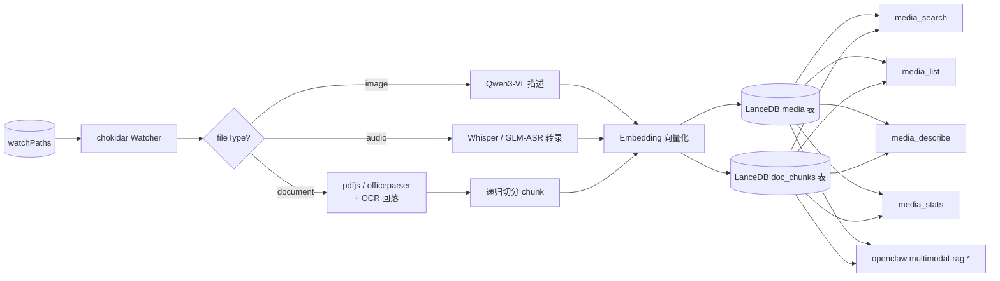

# Multimodal RAG Plugin

OpenClaw 多模态 RAG 插件 —— 使用本地 AI 模型对**图像 / 音频 / 文档**做语义索引与时间感知搜索。源文件删除时自动移除索引（不会删除原文件）。



## 能力一览

| 能力 | 实现 |
| --- | --- |
| 图像理解 | Qwen3-VL（默认 `qwen3-vl:2b`），HEIC 自动 ffmpeg 拼图 |
| 音频转录 | 本地 Whisper CLI 或智谱 GLM-ASR-2512（>30s 自动切片） |
| 文档解析 | PDF (`pdfjs-dist`) / docx-xlsx-pptx (`officeparser`) / txt-md-html 原文；扫描页走 OCR 回落 |
| OCR | 复用 Ollama VLM（`ocrModel` 或 fallback `visionModel`）；PDF 渲染用 `pdftoppm`（poppler） |
| Chunk 切分 | 递归"段落→句子→字数"，默认 800 字符 + 120 overlap |
| 向量化 | Ollama `qwen3-embedding`（4096 维）或 OpenAI `text-embedding-3-*` |
| 向量存储 | LanceDB 双表：`media`（image/audio）+ `doc_chunks`（document）；带标量索引、auto-optimize、checkoutLatest |
| 文件监听 | chokidar，含 debounce、SHA256 去重、move-reuse（仅 media）、broken-file 隔离 |
| Agent 工具 | `media_search` / `media_list` / `media_describe` / `media_stats`（统一覆盖 media + document） |
| CLI | 9 个命令，包括 `doctor` / `index` / `search` / `cleanup-*` / `reindex` |
| 通知 | 批次聚合 → `openclaw agent --deliver` 触发 agent 主动回复 |

## 快速开始

```bash
# 安装
openclaw plugins install @hzttt/multimodal-rag@latest
openclaw plugins enable multimodal-rag

# 配置（编辑 ~/.openclaw/openclaw.json）
# 至少填 watchPaths；详见 docs/configuration.md

# 自检
openclaw multimodal-rag doctor

# 验证
openclaw multimodal-rag stats
openclaw multimodal-rag search "东方明珠"
```

最小配置示例（本地 Ollama + 本地 Whisper）：

```json
{
  "plugins": {
    "entries": {
      "multimodal-rag": {
        "enabled": true,
        "config": {
          "watchPaths": ["~/mic-recordings", "~/usb_data"]
        }
      }
    }
  }
}
```

完整配置参考、provider 切换、远程 Ollama、智谱 GLM-ASR、通知 targets 等场景见 [`docs/configuration.md`](./docs/configuration.md)。

## 前置依赖

- [Ollama](https://ollama.ai) 本地或网关，并已 `ollama pull qwen3-vl:2b qwen3-embedding:latest`
- `ffmpeg` 在 PATH 中（HEIC 拼图、音频格式转换、ffprobe 元数据）
- 音频转录二选一：
  - 本地 Whisper（`pipx install openai-whisper`，可用 `OPENCLAW_WHISPER_BIN` 覆盖路径）
  - 智谱 GLM-ASR（无需安装 Whisper，配置 `whisper.zhipuApiKey`）
- 文档索引（可选，启用 `fileTypes.document` 时）：
  - `pdftoppm`（来自 poppler）：PDF 扫描页 → PNG，供 OCR 使用。`brew install poppler` / `apt-get install poppler-utils`
  - OCR 默认复用 `ollama.visionModel`，也可自定义 `ollama.ocrModel`（例如 `gemma3:27b`）
  - 文本型 PDF 只用 `pdfjs-dist` 提取字符，不经过 OCR，无需 poppler

详细依赖检查清单见 [`docs/operations.md`](./docs/operations.md)。

## 文档导航

技术文档已按模块拆分，均以源代码为唯一可信源：

| 文档 | 主题 |
| --- | --- |
| [架构总览](./docs/architecture.md) | 组件拓扑、加载流程、运行时执行模型、deferred 配置策略 |
| [LanceDB 存储层](./docs/storage.md) | 表结构、标量索引、checkoutLatest、where→scan 回退、auto-optimize、清理 |
| [索引主链路](./docs/indexing-pipeline.md) | watcher 队列、indexFile 决策、重试与 broken-file、move-reuse、HEIC 拼图、GLM-ASR 切片 |
| [检索链路](./docs/search-and-retrieval.md) | query 向量化、minScore、去重、置信度、未索引兜底、失效自愈 |
| [Agent 工具](./docs/agent-tools.md) | 4 个工具的参数、返回、错误码、决策树 |
| [CLI 参考](./docs/cli-reference.md) | 9 个 CLI 命令的完整参数与示例 |
| [配置参考](./docs/configuration.md) | 完整字段表、provider 分支、典型场景 JSON |
| [通知机制](./docs/notifications.md) | 状态机、目标解析三级回退、agent --deliver 命令 |
| [运维与故障排查](./docs/operations.md) | doctor、broken-file marker、cleanup 三件套、健康检查、故障树 |
| [HTTP 接入接口](./docs/http-api.md) | `serve` 命令暴露的 `/get_file_info` 与 `/search_file` 契约 |

历史版本文档归档在 [`docs/legacy/`](./docs/legacy)。

## 许可证

MIT
