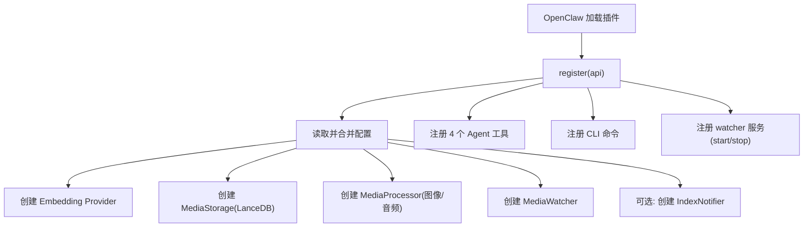
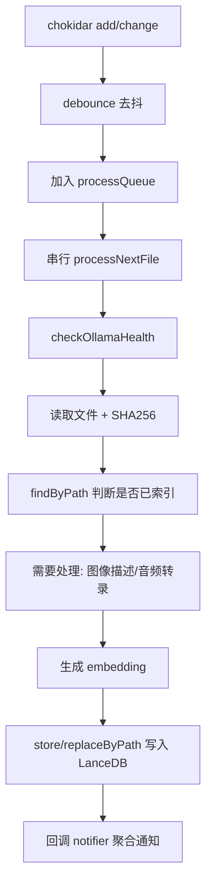
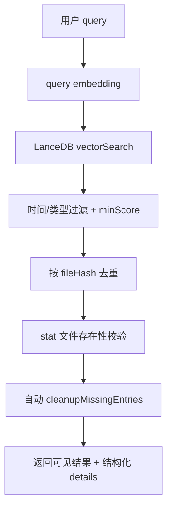

# Multimodal RAG 插件技术分析文档

## 1. 文档目标

本文基于当前代码实现，系统分析 `multimodal-rag` 插件的：

- 功能边界与对外能力（Agent 工具 + CLI 命令 + 服务）
- 核心实现原理（索引、检索、存储、通知、自愈）
- 关键模块职责与调用关系
- 稳定性设计、已知限制与优化方向

目标是让维护者可以快速理解“这套插件为什么这么实现、运行时如何工作、后续应该怎么改”。

---

## 2. 插件定位与总体能力

插件类型：`rag`（`openclaw.plugin.json`）

核心定位：对本地图片与音频做“先理解内容、再向量化索引”，供 Agent 和 CLI 进行语义检索与时间过滤。

### 2.1 支持的媒体类型

- 图片：`.jpg/.jpeg/.png/.webp/.gif/.heic`
- 音频：`.wav/.mp3/.m4a/.ogg/.flac/.aac`

### 2.2 对外能力清单

1. Agent 工具（`index.ts` 注册）
- `media_stats`：统计库状态与当前索引队列
- `media_search`：语义搜索（可按类型和时间过滤）
- `media_list`：时间倒序浏览（可包含未索引文件）
- `media_describe`：查看单文件完整描述，必要时触发重索引

2. CLI 命令（`openclaw multimodal-rag ...`）
- `doctor`
- `index <path>`
- `search <query>`
- `stats`
- `list`
- `cleanup-missing`
- `cleanup-failed-audio`
- `reindex`

3. 后台服务
- `multimodal-rag-watcher`：文件系统监听 + 自动索引

---

## 3. 运行架构与数据流

### 3.1 索引主链路（文件新增/修改）

### 3.2 检索主链路（search/list）

---

## 4. 模块级实现原理

## 4.1 插件入口 `index.ts`

职责：

- 合并默认配置与用户配置
- 初始化四大核心组件：`embeddings`、`storage`、`processor`、`watcher`
- 按开关创建 `IndexNotifier`
- 向 OpenClaw 注册工具、CLI、后台服务

关键设计点：

1. 配置合并在入口统一完成  
避免各模块重复处理默认值，降低分散配置导致的不一致风险。

2. `api.resolvePath(cfg.dbPath)`  
数据库路径支持 `~` 与相对路径，由 OpenClaw 统一解析，保证部署一致性。

3. 工具与 CLI 能力并存  
同一底层能力同时暴露给 Agent 和命令行，便于自动化与人工排障。

---

## 4.2 存储层 `src/storage.ts`（LanceDB）

职责：

- 管理 LanceDB 连接与表初始化
- 提供 CRUD、向量检索、分页、统计
- 提供“脏数据清理”和“缺失文件索引清理”

### 4.2.1 表结构

主表：`media`，核心字段：

- 标识：`id`
- 路径与类型：`filePath/fileName/fileType`
- 语义内容：`description/vector`
- 去重与变更：`fileHash/fileSize/fileModifiedAt`
- 时间：`fileCreatedAt/indexedAt`

初始化策略：创建表时先写一条 `__schema__` 占位行再删除，用于显式定义 schema。

### 4.2.2 一致性与回退策略

1. `refreshToLatest()`  
每次关键读写前尝试 `checkoutLatest()`，解决多实例/多渠道访问同一库时的可见性问题。

2. “where 查询 + 全量扫描回退”  
`findByPath/findByHash/findEntriesByPath` 先走 where；失败或无结果时回退到 `getAllRows()`，规避 LanceDB fragment 不一致问题。

3. `getAllRows()` 显式 `limit(totalRows)`  
代码中明确规避 `query().toArray()` 默认隐式 limit，保证“全量扫描”是真全量。

### 4.2.3 搜索算法

- LanceDB 返回 `_distance`（L2 距离）
- 插件换算为 `score = 1 / (1 + distance)`
- 先按 `minScore` 过滤
- 默认按 `fileHash` 去重，避免同一内容多副本重复展示

### 4.2.4 自愈清理能力

1. `cleanupFailedAudioEntries()`  
清理历史“转录失败文本被误写入 description”的音频脏记录。

2. `cleanupMissingEntries()`  
检测“索引存在但源文件已删除”并删除索引；支持 `dryRun/limit/candidates` 三种模式。

---

## 4.3 监听与索引执行 `src/watcher.ts`

职责：

- 使用 `chokidar` 监听目录变化
- 维护串行处理队列
- 对每个文件执行“识别 -> 向量化 -> 入库”
- 处理重试、失败标记、删除同步、自启动补扫

### 4.3.1 队列与并发模型

- `processQueue: Set<string>` 去重排队
- `processing` 标志确保串行处理，避免并发压垮模型服务
- `watchDebounceMs` 去抖，减少重复事件

### 4.3.2 文件处理判定逻辑

对单文件：

1. 判断扩展名映射 `image/audio`
2. 健康检查 `checkOllamaHealth()`（60 秒缓存）
3. 读文件并计算 `SHA-256`
4. `findByPath` 判断是否已存在
5. 若 hash 不变且 size/mtime 不变 -> 直接跳过
6. 若 hash 不变但元数据变更 -> 复用旧 `description/vector` 更新元数据
7. 否则执行内容处理 + embedding + 存储

这一设计的核心是：把“内容分析成本”留给真正变化的文件。

### 4.3.3 错误分层与重试

1. 临时错误（Ollama 不可用、网络超时等）  
最多重试 3 次，每次延迟 60 秒。

2. 非临时错误  
标记为 broken file，写入 `${dbPath}.broken-files.json`。

3. broken file 跳过机制  
若文件大小和 mtime 未变化，后续扫描/事件直接跳过，防止永久失败文件反复消耗资源。

### 4.3.4 删除同步与路径归一化

- `unlink` 事件触发 `removeIndexedEntryForDeletedFile`
- 先按原始路径删，删不到再按 `realpath` 归一化比对删  
解决软链接/路径别名导致的“同文件不同字符串路径”问题。

### 4.3.5 启动自愈

watcher `ready` 后异步执行：

- `cleanupMissingIndexedFiles()`：清理失效索引
- `scanAndIndexMissingFiles()`：扫描目录，把未索引文件入队

---

## 4.4 多模态处理 `src/processor.ts`

统一实现 `IMediaProcessor`，分图像与音频两条链路：

1. 图片处理  
- 读取文件 -> base64  
- 调用 Ollama `/api/chat` + 视觉模型（默认 `qwen3-vl:2b`）  
- 生成中文细粒度描述（场景、人物、文字、时间线索、氛围）

2. 音频处理  
- 调用本地 `whisper` CLI（可用 `OPENCLAW_WHISPER_BIN` 或 `WHISPER_BIN` 覆盖路径）  
- 读取 txt 输出，失败时回退 stdout/stderr  
- 若出现“转录失败标记”或空结果，抛 `AudioTranscriptionError`

说明：音频转录链路依赖系统安装 `whisper` 与 `ffmpeg`。

---

## 4.5 向量服务 `src/embeddings.ts`

抽象接口：`IEmbeddingProvider`

实现：

- `OllamaEmbeddingProvider`（默认）
- `OpenAIEmbeddingProvider`（备选）

关键点：

1. Ollama 重试  
对 5xx 与 `ECONNRESET` 做最多 3 次重试（指数式延迟系数）。

2. 维度由模型名推断  
Ollama 分支通过模型字符串推断向量维度（`0.6b -> 2048`, 其他默认 4096）；OpenAI 分支按 small/large 推断 1536/3072。

3. 工厂函数统一入口  
`createEmbeddingProvider` 根据配置返回对应 provider，`openai` 缺 key 时直接抛错。

---

## 4.6 Agent 工具层 `src/tools.ts`

### 4.6.1 `media_search`

- 输入：`query/type/after/before/limit`
- 流程：query embedding -> vector search -> 文件存在性校验 -> 自动清理失效索引 -> 返回结果
- 结果同时给：
  - `content`：可读文本（给 Agent）
  - `details`：结构化对象（给程序）

实现特征：

- 工具层阈值 `minScore=0.25`（比 CLI 低，偏召回）
- 强约束提示 Agent“不要只描述，要发送媒体文件”

### 4.6.2 `media_list`

- 数据源 = 已索引数据 + 可选未索引磁盘文件
- `includeUnindexed=true` 时递归扫描 watchPaths，补齐“刚写入但尚未入库”的文件
- 合并后统一按时间倒序分页，并标记 `indexed=true/false`

该设计解决了“语义索引异步导致短时间不可见”的体验缺口。

### 4.6.3 `media_describe`

- 如果记录不存在或 `refresh=true`，直接调用 `watcher.indexPath` 触发分析
- 返回单文件完整描述与时间元数据

### 4.6.4 `media_stats`

- 返回总量、图片数、音频数
- 若注入 watcher，附带当前队列状态（pending/processing）

---

## 4.7 通知系统 `src/notifier.ts`

职责：将离散索引事件聚合为“开始通知 + 完成总结”。

状态机：

- `idle` -> `batching`（首个 queued）
- batching 期间持续更新批次状态
- 满足条件后 `finalizeBatch`，回到 `idle`

两个关键计时器：

- `quietWindowMs`：最后活动后静默多久再发总结
- `batchTimeoutMs`：最长批次时长上限

消息投递原则：

- 插件不直接发最终文本
- 通过 `openclaw agent --deliver` 触发 agent 生成并投递通知
- 目标选择优先级：
  1. `notifications.targets`
  2. `notifications.channel/to`
  3. session store 推断“最近活跃目标”

这样做的收益是：通知风格与当前 agent 人设一致，不破坏会话语气。

---

## 4.8 原生插件配置与诊断

当前实现已经移除 `setup` 配置引导，统一改为 OpenClaw 原生插件配置：

1. 安装并启用插件  
2. 在 `plugins.entries.multimodal-rag.config` 下写入配置  
3. 使用 `openclaw multimodal-rag doctor` 做依赖和缺失项检查

这带来的变化是：

- manifest 成为静态配置契约的唯一来源
- 插件注册阶段不再因为可选 provider key 缺失而直接失败
- 具体 provider 错误被推迟到搜索、索引、转录等实际执行路径

---

## 5. 配置模型与契约

`openclaw.plugin.json` 中定义了完整 `configSchema` 与 `uiHints`，核心配置包括：

- 监听路径与文件扩展名
- 模型服务（Ollama URL、vision model、embedding model）
- embedding provider（ollama/openai）
- 数据库路径
- 启动索引策略
- 通知行为（开关、目标、静默窗口、批次超时）

契约特点：

- 默认值尽量可直接运行（本地 Ollama + 本地 LanceDB）
- 高级项（如 dbPath、通知目标）通过 UI hints 标记为 advanced

---

## 6. 可靠性与性能设计总结

## 6.1 已实现的稳态策略

1. 串行索引队列：降低模型服务并发冲击  
2. debounce + unchanged 检测：减少重复计算  
3. 失败重试 + broken 文件隔离：避免无限失败循环  
4. 路径归一化与删除同步：减少脏索引残留  
5. 检索侧自动清理失效索引：读路径即自愈  
6. 启动自愈：先清理再补扫  

## 6.2 已知代价

1. `fileHash` 通过整文件读入计算，大文件时内存开销较高  
2. `list/count` 依赖全量扫描，库规模大时耗时上升  
3. 检索结果存在性校验使用逐条 `stat`，大量结果时会增加 IO 延迟  

---

## 7. 已知限制与改进建议

## 7.1 代码层可见限制

1. Embedding 维度推断依赖模型名字符串  
如果模型实际维度与推断不一致，可能导致向量维度错配。

2. Watcher 的健康检查固定依赖 Ollama  
当 embedding provider 设为 `openai` 时，音频/图片处理仍依赖 Ollama（视觉模型），但当前健康门控策略会影响整体索引路径，建议拆分“视觉依赖健康检查”和“embedding 依赖健康检查”。

3. 版本号存在不一致  
`openclaw.plugin.json` 为 `0.1.0`，`package.json` 为 `0.3.4`，发布与排障时可能引发认知偏差。

4. 自动化测试覆盖不足  
`test/` 目录以调试脚本为主，缺少稳定的单元/集成测试套件。

## 7.2 建议优先级（从高到低）

1. P1：补充关键路径测试（索引成功/失败重试/删除清理/搜索过滤）  
2. P1：统一版本来源（manifest 与 package）  
3. P2：为 hash 计算引入流式读取（降低内存峰值）  
4. P2：将 `list/count` 演进为可选增量统计或可索引字段查询  
5. P3：对 `openai` provider 场景细化健康检查与日志提示

---

## 8. 结论

该插件的实现重点不是“单次搜索准确率”，而是构建一条可持续运行的本地多模态索引流水线：  
监听文件变化 -> 稳定处理 -> 向量入库 -> 自愈清理 -> Agent/CLI 可检索。

从工程角度看，代码已经覆盖了真实运行中最常见的问题类型（模型波动、文件删除、路径别名、历史脏数据、通知聚合），具备“可长期运行”的产品雏形。下一阶段价值主要在于：测试体系化、性能分层优化、配置与发布一致性治理。
