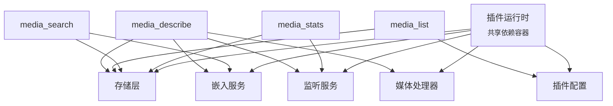

# Agent 工具完整参考

本文记录 multimodal-rag 插件向 Agent 暴露的 4 个工具的全部行为。每条参数、返回字段、错误码、内部分支都来自 `src/tools.ts` 与 `src/runtime.ts` 的真实实现。

如果想从命令行手动验证同一组行为，请参考姊妹文档 [`cli-reference.md`](./cli-reference.md)。

---

## 工具注册与依赖

工具注册阶段会按以下顺序把 4 个工具挂到插件运行时上：

1. `media_stats`（依赖：存储层、监听服务）
2. `media_search`（依赖：存储层、嵌入服务）
3. `media_list`（依赖：存储层、插件配置）
4. `media_describe`（依赖：存储层、媒体处理器、嵌入服务、监听服务）

所有工具共享同一个插件运行时实例（按宿主对象缓存）。注册前，运行时已完成配置加载、存储层、嵌入服务、媒体处理器、监听服务、通知器的装配。



> 共享引用意味着：通过任意工具触发的索引、清理、计数会立刻被其他工具感知。`media_search` 与 `media_list` 在每次查询前都会让存储层刷新到最新版本，从而确保不同聊天渠道开出的插件实例都看到同一份数据。

---

## 公共行为约定

下列内部辅助能力被多个工具共用，理解它们有助于读懂错误码与返回结构。

| 能力 | 行为 |
| --- | --- |
| 构造文本内容块 | 返回 `[{ type: "text", text }]`，所有工具的 `content` 字段都是这种结构 |
| ISO 日期解析 | 校验 ISO 字符串；空值视为未传；非字符串报 `${field} 必须是 ISO 日期字符串`；非法日期报 `${field} 不是合法日期，示例：2026-02-05T23:59:59` |
| 正整数解析 | 校验整数 `>= min`；不合法时回退默认值并附带 `${field} 必须是 >= ${min} 的整数` |
| 路径 ~ 展开 | 把 `~/...` 与 `~` 展开为家目录下的绝对路径 |
| 结果文件存在性兜底校验 | 对每个候选条目做一次 `stat`；`ENOENT/ENOTDIR` 视为缺失，其他失败保守视为存在；返回存在与缺失两组 |
| 磁盘兜底扫描 | 递归遍历目录，跳过隐藏项（`.` 开头），按扩展名过滤；硬上限为目标条数的 20 倍；按修改时间倒序后取所需条数 |
| 缺失路径错误判定 | 识别 `ENOENT/ENOTDIR` 之类错误，作为"文件不存在"的统一标志 |

> 跨工具的共性：所有 `content` 字段统一为单条 text；所有错误形态都会同时在 `details.error` 写一个稳定字符串码，便于调用方判断。

---

## media_search

**用途**：对已完成索引的本地媒体库做语义搜索（图片描述 / 音频转录），可叠加时间过滤。

> 工具描述明确指出：仅能搜索"已完成索引"的数据。如果文件刚生成尚未索引完成，应改用 `media_list`（`includeUnindexed=true`）从磁盘侧拿真实路径。

### 参数 schema

| 参数 | 类型 | 必填 | 默认值 | 说明 |
| --- | --- | --- | --- | --- |
| `query` | `string` | 是 | — | 简短关键词，例如 `"东方明珠"`、`"会议"`、`"食物"`，避免完整问句 |
| `type` | `"image" \| "audio" \| "all"` | 否 | `"all"` | 媒体类型筛选 |
| `after` | `string`（ISO 日期） | 否 | `undefined` | 不早于该时间，示例 `2026-01-29T00:00:00` |
| `before` | `string`（ISO 日期） | 否 | `undefined` | 不晚于该时间，示例 `2026-02-05T23:59:59` |
| `limit` | `number` | 否 | `5` | 返回数量；建议 3-10 |

### 返回 content

成功命中：

```
✅ 找到 N 个相关媒体文件（置信度: 高|中|低）：

1. [image|audio] <fileName> (匹配度: 87%)
   📁 路径: /abs/path
   📅 时间: YYYY/MM/DD HH:mm
   📝 描述: ...

⚠️ 立即使用当前聊天渠道对应的方式将上述文件发送给用户！
```

未命中：

```
未找到与「<query>」相关的媒体文件。

数据库中共有 N 个已索引文件。建议：
1. 尝试使用更通用的关键词
2. 使用 media_list 工具浏览所有文件
3. 调整时间范围（如果设置了 after/before）
（可能附加：已自动清理 X 条"源文件已删除"的失效索引。）
```

错误兜底：

```
搜索时遇到技术问题，请稍后重试。

数据库中共有 N 个已索引文件。
错误详情: <message>
```

### 返回 details

命中：

| 字段 | 类型 | 含义 |
| --- | --- | --- |
| `count` | `number` | 实际可见结果数（已剔除源文件缺失的条目） |
| `query` | `string` | 规范化后的查询串 |
| `maxMatchScore` | `number` | 最高匹配分数百分比（保留 1 位小数） |
| `confidence` | `"高" \| "中" \| "低"` | `>60` 高、`>40` 中、其余低 |
| `cleanedMissing` | `number` | 本次顺手清理的失效索引条数 |
| `results[]` | `Array` | 单条包含 `filePath / fileName / type / description / matchScore / fileCreatedAt(ISO) / fileModifiedAt(ISO)` |

未命中：

| 字段 | 类型 | 含义 |
| --- | --- | --- |
| `count` | `0` | — |
| `query` | `string` | — |
| `totalInDatabase` | `number` | 全库总数 |
| `cleanedMissing` | `number` | 顺带清理条数 |
| `suggestion` | `string` | 固定值 `"try_broader_keywords_or_use_media_list"` |

错误兜底：

| 字段 | 类型 | 含义 |
| --- | --- | --- |
| `count` | `0` | — |
| `query` | `string` | — |
| `error` | `string` | 错误信息文本（不是错误码） |
| `totalInDatabase` | `number` | 兜底再查一次，失败则 `0` |

### 内部行为

1. 校验 `query` 不为空 → 错误码 `invalid_query`。
2. 解析 `after / before`，互检顺序 → 错误码 `invalid_after / invalid_before / invalid_date_range`。
3. 校验 `limit` → 错误码 `invalid_limit`，回退默认 5。
4. 调用嵌入服务生成查询向量。
5. 调用存储层做语义搜索，参数 `{ type, after, before, limit, minScore: 0.25 }`。**工具层 `minScore=0.25`**，比 CLI 的 `0.3` 更宽松，目的是提高 Agent 召回。
6. 对命中条目做结果文件存在性兜底校验：源文件已被删除的条目走存储层做失效索引清理立即从索引中移除，并记入 `cleanedMissing`。
7. 渲染人读文本、计算最高分置信度标签、构造 details；并在文末追加一条强制提醒，要求 Agent 立即把文件发出去。
8. 嵌入或搜索抛错时进入兜底分支，返回错误详情但不再向上抛。

### 强制提醒文案

工具描述与命中结果都会附加：

> ⚠️ 搜索到结果后，你必须立即将媒体文件发送给用户！
> ❌ 禁止询问'需要我发送给你吗？'
> ❌ 禁止只描述文件内容而不发送实际文件
> ✅ 根据当前聊天渠道，使用该渠道对应的方式发送图片/音频文件

这是工具契约的一部分，不要把这段当作可选建议。

### 与 CLI 等价命令

```bash
openclaw multimodal-rag search "<query>" \
  --type image|audio|all \
  --after 2026-01-29T00:00:00 \
  --before 2026-02-05T23:59:59 \
  --limit 5
```

注意：CLI 使用 `minScore=0.3`，返回结果可能少于工具调用。详见 [cli-reference.md → search](./cli-reference.md#openclaw-multimodal-rag-search-query)。

### 典型错误码（details.error）

| 错误码 | 触发条件 |
| --- | --- |
| `invalid_query` | `query` 为空或非字符串 |
| `invalid_after` | `after` 不是合法 ISO |
| `invalid_before` | `before` 不是合法 ISO |
| `invalid_date_range` | `after > before` |
| `invalid_limit` | `limit` 不是 `>= 1` 的整数 |
| `<message>` | embedding/search 抛错时直接放原始消息 |

**源码**：`src/tools.ts:196-420`（主体）；注册见 `src/runtime.ts:120-122`

---

## media_describe

**用途**：拿到指定媒体文件的完整描述。如果数据库里还没有这条记录（或调用方显式 `refresh`），会让监听服务现场对该路径做即时索引，然后再读出来。

> 工具描述提示：当 `media_list` / `media_search` 返回的描述太粗、不足以回答"数数有几个人"这类具体问题时，应调用本工具拿完整分析。

### 参数 schema

| 参数 | 类型 | 必填 | 默认值 | 说明 |
| --- | --- | --- | --- | --- |
| `filePath` | `string` | 是 | — | 媒体文件绝对路径 |
| `refresh` | `boolean` | 否 | `false` | 强制重新分析（即使数据库已有记录） |

### 返回 content

成功：

```
文件: <fileName>
类型: image|audio
路径: /abs/path
创建时间: YYYY/MM/DD HH:mm:ss（zh-CN locale）
索引时间: YYYY/MM/DD HH:mm:ss

描述:
<description>
```

参数错误：`filePath 不能为空`

索引失败：`无法索引文件: <message>` 或 `无法索引文件: <path>。请检查文件是否存在且为支持的格式。`

### 返回 details

成功：

| 字段 | 类型 | 含义 |
| --- | --- | --- |
| `filePath` | `string` | 绝对路径 |
| `fileName` | `string` | 文件名 |
| `type` | `"image" \| "audio"` | 媒体类型 |
| `description` | `string` | 完整描述（图片描述或音频转录） |
| `fileCreatedAt` | `string`（ISO） | 文件创建时间 |
| `indexedAt` | `string`（ISO） | 索引完成时间 |

失败：`{ error: "invalid_file_path" }` 或 `{ error: "indexing_failed", message? }`。

### 内部行为

1. 规范化 `filePath`（trim），空串返回 `invalid_file_path`。
2. 调用存储层按路径查找记录。
3. 如果不存在，或 `refresh=true`：触发监听服务对该路径做即时索引，捕获异常后返回 `indexing_failed` 并把 `message` 透传到 details。
4. 重新按路径查找；仍取不到则返回 `indexing_failed` 但不带 `message`。
5. 渲染中文 locale 的时间戳，构造结构化 details。

> 监听服务的即时索引同时支持单个文件与目录递归。当传入目录时，监听服务会逐项排队处理；本工具仅在调用结束后再次按路径查找，因此目录索引完成前可能仍取不到目标条目。

### 与 CLI 等价命令

没有 1:1 等价命令。最近的对照：

- 触发索引：`openclaw multimodal-rag index <path>`。
- 想查看描述则需要再用 `openclaw multimodal-rag list` 或 `search` 浏览，CLI 没有"按 filePath 直查描述"的命令。

### 典型错误码（details.error）

| 错误码 | 触发条件 |
| --- | --- |
| `invalid_file_path` | `filePath` 为空 / 非字符串 |
| `indexing_failed` | 即时索引抛错，或索引完成后仍找不到记录 |

**源码**：`src/tools.ts:425-501`（主体）；注册见 `src/runtime.ts:126-131`

---

## media_stats

**用途**：返回媒体库的总体计数与索引队列状态。回答"有多少照片""录了多少音""有哪些文件"等问题。

### 参数 schema

不接受任何参数（参数 schema 为空对象）。

### 返回 content

空库：

```
媒体库为空。

（如果有 watcher）当前索引队列：处理中: <name|无>，等待: N 个

新文件会在添加到监听目录后自动索引。
```

非空：

```
📊 媒体库统计:

总计: N 个文件
图片: N 个
音频: N 个
（如果有 watcher）
索引队列:
- 处理中: <name|无>
- 等待: N 个

💡 使用 media_search 搜索内容，或 media_list 浏览文件列表。
```

### 返回 details

空库：`{ total: 0, imageCount: 0, audioCount: 0 }`（无 `queue` 字段）。

非空：

| 字段 | 类型 | 含义 |
| --- | --- | --- |
| `total` | `number` | 全库条数 |
| `imageCount` | `number` | 图片条数 |
| `audioCount` | `number` | 音频条数 |
| `queue` | `{ pending: string[]; processing: string \| null }` | 来自监听服务的队列快照；无监听服务时缺省 |

> 三个计数分别让存储层计数全部 / 图片 / 音频，不做缓存；与 CLI `stats` 命令使用相同接口。

### 内部行为

1. 串行让存储层做三次计数（全部 / `"image"` / `"audio"`）。
2. 如果构造时传入了监听服务，取一次队列快照，否则忽略。
3. 根据 `total` 是否为 0 选择两种渲染分支。

### 与 CLI 等价命令

```bash
openclaw multimodal-rag stats
```

CLI 的输出格式略有不同，且不会显示队列。详见 [cli-reference.md → stats](./cli-reference.md#openclaw-multimodal-rag-stats)。

### 典型错误码

无显式错误码；底层计数抛错时会逐层冒泡给工具运行框架。

**源码**：`src/tools.ts:506-549`（主体）；注册见 `src/runtime.ts:117-119`

---

## media_list

**用途**：按时间倒序列出媒体文件，可叠加时间过滤；默认会把磁盘上"尚未索引"的新文件也合并进来，便于 Agent 立刻拿到真实路径再去发送或触发索引。

### 参数 schema

| 参数 | 类型 | 必填 | 默认值 | 说明 |
| --- | --- | --- | --- | --- |
| `type` | `"image" \| "audio" \| "all"` | 否 | `"all"` | 媒体类型筛选 |
| `after` | `string`（ISO 日期） | 否 | `undefined` | 不早于该时间 |
| `before` | `string`（ISO 日期） | 否 | `undefined` | 不晚于该时间 |
| `limit` | `number` | 否 | `20` | 返回数量 |
| `offset` | `number` | 否 | `0` | 分页偏移 |
| `includeUnindexed` | `boolean` | 否 | `true` | 是否合并磁盘扫描结果（`indexed=false`） |

### 返回 content

有结果：

```
📋 媒体文件列表：

1. [image|audio] <fileName>[ ⏳(未索引)]
   📅 YYYY/MM/DD HH:mm
   📁 /abs/path
   📝 <description 或：（未索引，description 为空，可用 media_describe 触发分析）>

…

（显示 X-Y，共 N 个。使用 offset 参数查看更多）  // 或：（共 N 个文件）

💡 indexed=false 的文件说明还没索引完；需要分析时可用 media_describe 触发索引并获取详细描述。
```

无结果：

```
没有找到符合条件的媒体文件。

数据库中共有 N 个文件。建议调整过滤条件或使用 media_stats 查看总体情况。
（可能附加：已自动清理 X 条失效索引。）
```

### 返回 details

有结果：

| 字段 | 类型 | 含义 |
| --- | --- | --- |
| `total` | `number` | 合并去重后的全部条数（已索引 + 未索引） |
| `showing` | `number` | 当前页实际返回条数 |
| `indexedTotal` | `number` | 已索引、且 `stat` 通过的条数 |
| `unindexedCount` | `number` | 通过磁盘扫描发现的未索引条数 |
| `cleanedMissing` | `number` | 本次顺带清理的失效索引条数 |
| `files[]` | `Array` | 每条 `{ filePath, path, fileName, type, indexed, description, fileCreatedAt(ISO), indexedAt(ISO 或 "") }` |

> `path` 字段与 `filePath` 同值，是为了照顾不同 Agent 的字段习惯。
> `indexedAt` 在 `indexed=false` 的条目上会输出空字符串。

无结果：`{ total: 0, totalInDatabase, cleanedMissing, files: [] }`。

### 内部行为

1. 解析 `after / before / limit / offset`，错误码：`invalid_after / invalid_before / invalid_date_range / invalid_limit / invalid_offset`。
2. 调用存储层做列表查询，主动多取一些（上限取 `max(limit+offset, 100)`）以便和未索引文件合并后再分页。
3. 对已索引条目做结果文件存在性兜底校验；缺失的让存储层做失效索引清理立即删除。
4. 如果 `includeUnindexed=true`：把配置中的图片/音频扩展名归一化为小写，遍历配置里的监听路径（先做路径 ~ 展开），逐目录做磁盘兜底扫描（每目录上限 `max(limit+offset, 20)`），再剔除已索引路径并应用时间过滤。
5. 把已索引和未索引拼成统一结构，按 `fileCreatedAt` 倒序，再按 `offset/limit` 切片。
6. 渲染人读文本（区分 `⏳(未索引)` 标记），构造 details。

### 与 CLI 等价命令

```bash
openclaw multimodal-rag list \
  --type image|audio|all \
  --after 2026-01-01T00:00:00 \
  --before 2026-02-01T00:00:00 \
  --limit 20 \
  --offset 0
```

注意：CLI 的 `list` **不**做磁盘兜底，只显示数据库内已索引的条目。详见 [cli-reference.md → list](./cli-reference.md#openclaw-multimodal-rag-list)。

### 典型错误码（details.error）

| 错误码 | 触发条件 |
| --- | --- |
| `invalid_after` | `after` 非合法 ISO |
| `invalid_before` | `before` 非合法 ISO |
| `invalid_date_range` | `after > before` |
| `invalid_limit` | `limit` 不是 `>= 1` 的整数 |
| `invalid_offset` | `offset` 不是 `>= 0` 的整数 |

**源码**：`src/tools.ts:554-803`（主体）；磁盘兜底见 `src/tools.ts:117-191`；注册见 `src/runtime.ts:123-125`

---

## 工具选型决策树


判断要点：

- 库的总量 / 队列 → `media_stats`
- 时间维度浏览（含未索引兜底） → `media_list`
- 关键词或语义搜索（仅已索引） → `media_search`
- 单文件详情，或显式触发 / 强刷索引 → `media_describe`

---

## 数据共享与跨渠道一致性

- 所有工具实例都通过同一份存储层读写；存储层在语义搜索、列表、计数、按路径查找、按 hash 查找等查询前都会先刷新到最新版本，保证不同聊天渠道开出的插件实例不会停留在旧版本表上。
- `media_search` 与 `media_list` 都会在结果可见前对每个候选做结果文件存在性兜底校验，把源文件已删除的条目交给存储层立即做失效索引清理。`cleanedMissing` 字段会同步透传给调用方，并在用户可见文案里追加一条提示。
- `media_describe` 通过监听服务的即时索引会进入索引队列；`media_stats` 的 `queue` 字段反映的是同一队列的实时状态。

---

## 文档（document）类型支持

四个工具均兼容 `document`，统一覆盖 image / audio / document：

- `media_search`：新增 `type='document'`，默认 `type='all'` 会并发查 media 与 doc_chunks 两张表并按 score 合并；文档结果**按 filePath 聚合**（每文件一行 + 最高分 chunk 的 ~120 字 snippet + 页码/标题锚点）。底层调 `storage.unifiedSearch`。
- `media_list`：新增 `type='document'`，走 `storage.listDocSummaries`，**不走磁盘兜底**（文档无 image/audio 那种"未索引但已存在"的 fallback 语义）。
- `media_describe`：先看 media 表 `findByPath`；未命中则看 `findDocChunksByPath`。文档路径返回"前 3 段预览 + 总段数/字符数 + 页码/标题锚点"。
- `media_stats`：返回 `imageCount / audioCount / docCount / docChunksCount` 四项。

> 聚合策略与 snippet 长度由 `src/tools.ts:formatUnifiedHit` 与 `storage.searchDocsAggregated` 决定（默认 `snippetMaxChars=120`）。

## 相关文档

- 命令行入口：[`cli-reference.md`](./cli-reference.md)
- 插件总览（配置、运行、部署、排障）：[`../CLAUDE.md`](../CLAUDE.md)
