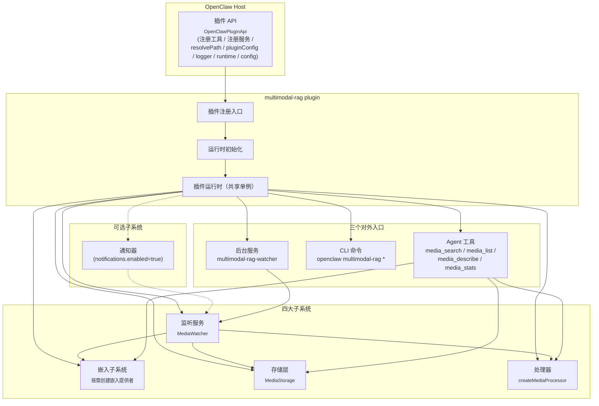
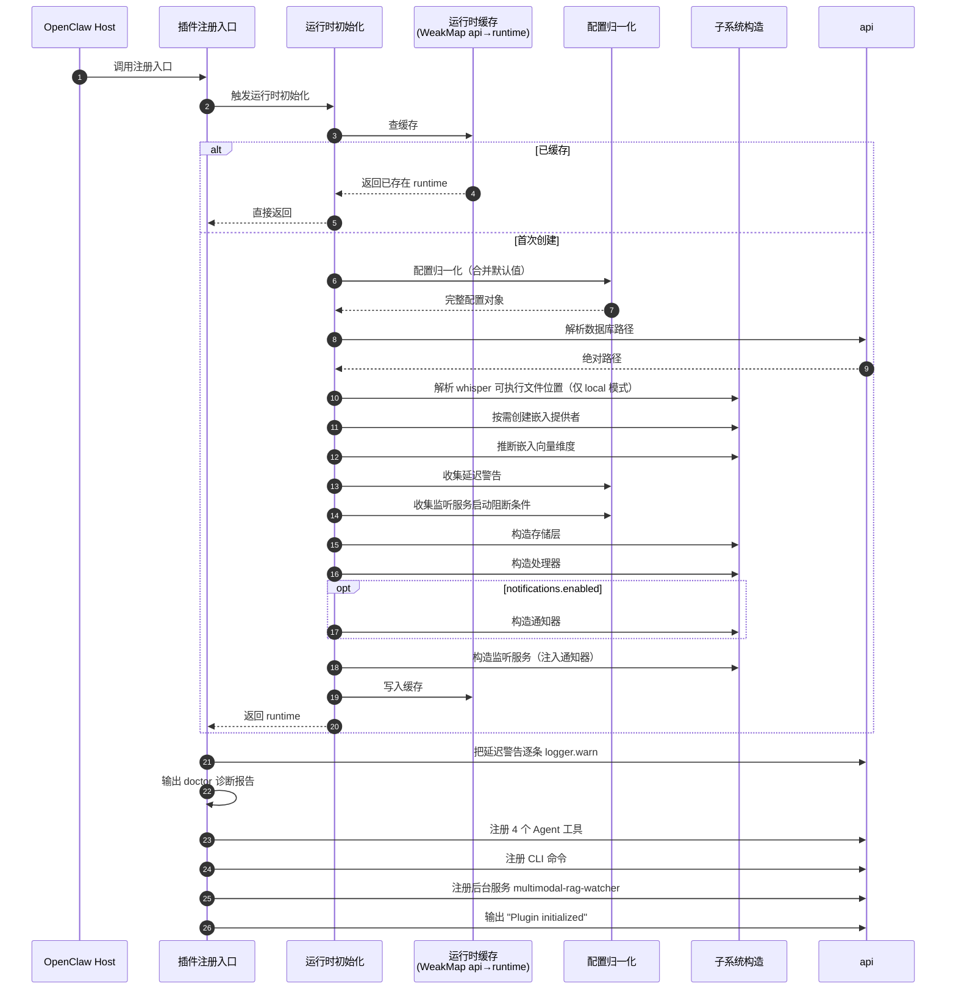
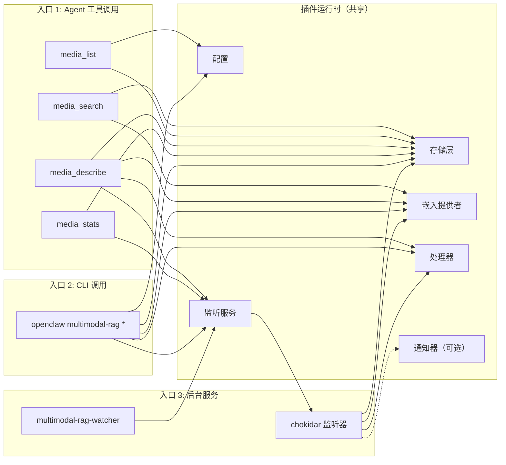
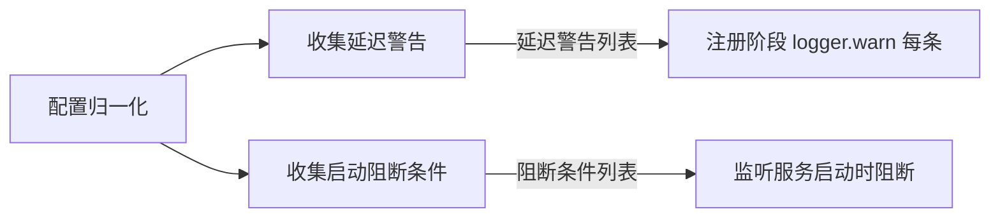
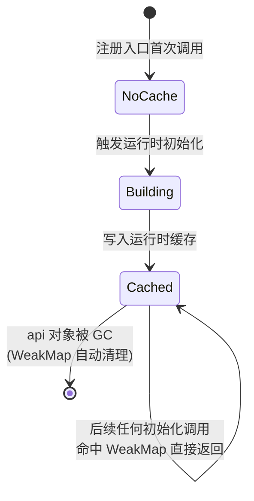

# Multimodal RAG 架构

> 本文档描述 multimodal-rag 插件的系统架构、组件拓扑、加载流程与运行时执行模型。
> 所有事实均来源于源代码，关键决策点都标注了文件路径与行号。
>
> 关联阅读：
> - [LanceDB 存储层细节](./storage.md)
> - [索引主链路](./indexing-pipeline.md)
> - [检索链路](./search-and-retrieval.md)
> - [Agent 工具](./agent-tools.md) / [CLI 参考](./cli-reference.md)
> - [配置](./configuration.md) / [通知](./notifications.md) / [运维](./operations.md)
> - [插件总览（README）](../README.md)

---

## 1. 定位与边界

multimodal-rag 是一个 OpenClaw 插件，定位是为本地图像和音频提供**语义索引与时间感知搜索**（参见 `openclaw.plugin.json:2-4`）。

**该插件做什么**

- 监听一个或多个本地目录（配置项 `watchPaths`，参见 `openclaw.plugin.json:10-15`）
- 对监听到的图像/音频文件调用本地或云端模型生成描述/转录
- 把描述向量化后存入本地 LanceDB
- 通过 4 个 Agent 工具（`media_search` / `media_list` / `media_describe` / `media_stats`）让 Agent 能查询索引（参见 `src/runtime.ts:117-131`）
- 通过 CLI 命令暴露相同的能力（参见 `index.ts:110`）
- 启动时可选择把现有文件全部索引一次（配置项 `indexExistingOnStart`，参见 `openclaw.plugin.json:117-121`）
- 可选地把"开始/完成索引"事件通过通知器转发给某个 Agent（参见 `src/runtime.ts:94-96`）

**该插件不做什么**

- 不删除原始媒体文件。manifest 描述明确写到："源文件删除时自动移除索引（不会删除原文件）"（参见 `openclaw.plugin.json:4`）。源文件丢失时只清理对应的索引条目（实现见 `src/storage.ts:664-734`）
- 不把媒体二进制存进 LanceDB。LanceDB 中只保留路径、描述、向量与元数据，参见 `MediaEntry` schema（`src/types.ts:10-23`）
- 不实现自己的视觉/转录模型，全部委托外部服务：Ollama 用于视觉描述与嵌入，本地 Whisper CLI 或智谱 GLM-ASR 用于语音转录（处理器细节超出本文档范围，参见 `src/processor.ts`）

---

## 2. 组件拓扑

插件注册入口（`index.ts:92-122`）通过插件运行时初始化装配出一个共享的运行时对象（参见 `src/runtime.ts:23-35`），然后把它分发给三类 OpenClaw 注册点：tools、CLI、service。

**关键事实**

- 插件运行时把所有共享对象集中持有，包括配置、解析后的数据库路径、whisper 可执行文件位置、嵌入提供者、存储层、处理器、监听服务、可选通知器、向量维度、以及两个诊断列表（延迟警告与监听服务启动阻断条件）。所有这些字段的定义集中在 `src/runtime.ts:23-35`
- 通知器仅在 `notifications.enabled === true` 时实例化，是整个插件唯一的可选组件（参见 `src/runtime.ts:94-96`）
- 监听服务在构造时注入通知器，由它在文件队列/索引/失败时回调通知器，进而触发 Agent 回复（参见 `src/runtime.ts:97`）

**Barrel 导出**

`plugin-runtime.ts` 是一个 barrel，把嵌入提供者工厂、处理器、存储层、监听服务、通知器、whisper 可执行文件解析器、工具注册函数、配置类型重新导出，方便运行时模块用一行 `import` 拿全部子系统（参见 `src/runtime.ts:2-9`）。这同时是插件包的内部"公共面"。

---

## 3. 加载流程

下面这张时序图覆盖了从 OpenClaw 调用插件注册入口到插件完全注册完毕的全过程。

完整调用链覆盖在 `index.ts:92-120`、`src/runtime.ts:74-114` 与配置层（`src/config.ts`）。

**关键观察**

- 注册入口本身是同步的，不会 await。所有真正"重"的初始化（LanceDB 连接、文件扫描）都被推迟到运行时（首次工具调用或服务启动时）
- 配置归一化把 partial config 合并默认值，保证下游永远拿到一份完整的配置对象
- 延迟警告与监听服务启动阻断条件是诊断信息：前者会被 logger.warn 打印（`index.ts:94-96`），后者则在监听服务试图启动时阻断启动（参见第 4 节）
- 加载阶段就把诊断报告完整打印一次，让用户在不主动跑 `openclaw multimodal-rag doctor` 命令的情况下也能看到环境问题

---

## 4. 三个执行入口

注册完成后，运行时同时被三个执行入口共享。三者使用同一份存储层、嵌入提供者与处理器，所以索引和检索是天然一致的。

**关键事实**

- 工具注册集中在运行时模块，每个工具用一组运行时对象构造（参见 `src/runtime.ts:117-131`）：
  - `media_stats` 需要存储层和监听服务
  - `media_search` 需要存储层和嵌入提供者
  - `media_list` 需要存储层和配置
  - `media_describe` 需要存储层、处理器、嵌入提供者和监听服务
- 后台服务的 start/stop 是监听服务的薄封装（参见 `src/runtime.ts:138-150`）。host 决定何时启动，插件本身不主动调用
- 监听服务的所有变化（queued / indexed / failed）都可以被通知器拿到，但**只有在通知器存在时**这些回调才会被订阅（依据监听服务构造签名 `runtime.ts:97`，通知器为可选第六参数）

**为什么入口共享同一个 runtime？**

因为运行时缓存以 api 实例做 key，并在每次运行时初始化的入口先查缓存（参见 `src/runtime.ts:37, 75-78`）。注册阶段只调一次初始化，但理论上插件其他模块也可以拿同一个 api 再调它，缓存确保它们拿到的是**完全相同的对象**——尤其重要的是存储层实例（持有 LanceDB 连接 + 标量索引就绪状态 + 自动优化计时器，参见 [storage.md](./storage.md)）。

---

## 5. 延迟配置策略

部分能力依赖外部凭据：`embedding.provider === "openai"` 需要 OpenAI API Key，`whisper.provider === "zhipu"` 需要智谱 API Key。如果在注册阶段直接尝试连接，缺凭据会让整个插件加载失败——但这些能力**只在被实际调用时**才需要。

插件用两个机制平衡"加载成功"和"运行时报错"：

### 5.1 按需创建嵌入提供者

嵌入提供者用一层惰性壳包裹真正的实现：第一次调用 `embed()` 时才真正构造底层 provider；维度查询不依赖凭据，使用纯函数推导（见 5.3）。这意味着如果 OpenAI key 缺失但配置选了 `provider: "openai"`，插件仍能完成注册；只有用户真的触发 `media_search` 或后台索引时才报错（实现见 `src/runtime.ts:47-72`）。

### 5.2 配置层警告与启动阻断

- 延迟警告：注册阶段就 `api.logger.warn` 打印（参见 `index.ts:94-96`）。属于"提示"，不阻断任何东西
- 启动阻断条件：传给监听服务用作硬性阻断条件（参见 `src/watcher.ts`），即使惰性嵌入壳里的报错也不会让监听服务反复重试

两段逻辑在运行时初始化时被同时调用（参见 `src/runtime.ts:85-86`）。

### 5.3 向量维度推断

存储层在构造时**必须**知道向量维度（参见 `storage.ts:68-72`），但惰性嵌入壳还没真正连接到模型。所以维度用纯静态规则推断：

| provider | 模型名包含 | 维度 |
|---|---|---|
| `openai` | `large` | 3072 |
| `openai` | 其他 | 1536 |
| `ollama` | `0.6b` | 2048 |
| `ollama` | 其他 | 4096 |

推断规则的实现见 `src/runtime.ts:39-45`。这个推断结果在两处使用：

1. 直接放进运行时对象，让外部诊断使用（参见 `runtime.ts:84, 108`）
2. 传给存储层构造函数，用于 LanceDB schema 占位行的零向量长度（参见 `runtime.ts:87` 与 [storage.md 表结构](./storage.md#1-表结构)）

> 注意：维度推断必须与真实嵌入维度一致，否则首次写入时 Arrow 会抛 schema 不匹配。换嵌入模型时如果维度变了，需要清空数据库重新初始化。

---

## 6. 运行时缓存设计

状态机覆盖在 `src/runtime.ts:75-78, 112`。

**为什么用 WeakMap 以 api 对象为 key？**

- **同一 api 实例只构造一份运行时**：注册入口在 `index.ts:93`，但 OpenClaw 的代码或测试可能在持有同一个 api 的情况下再次调用初始化（例如做诊断、做 dry-run）。如果每次都新建，会出现两个存储层实例同时打开同一个 LanceDB 路径——既浪费连接，又让自动优化计时器与标量索引就绪状态分裂
- **不同 api 实例隔离**：跨进程或跨"插件实例"重新加载时，api 是新对象，缓存不命中，自然得到全新运行时
- **WeakMap 的回收语义**：当 api 被宿主释放（例如插件被卸载），WeakMap 不会阻止 GC。运行时中的 LanceDB 连接、chokidar 监听器、自动优化计时器也会随之可被回收（参见 `storage.ts:207` 的 `unref?.()` 用法，确保不阻塞 Node 退出）

> 这是一种简单但严格的"按 api 实例 memoize"。比起在模块顶层用全局变量持有，它能正确支持多 api 场景，又不需要显式的卸载钩子。

---

## 7. 文件索引

| 路径 | 角色 |
|---|---|
| `index.ts` | 插件入口，定义兼容 wrapper、注册主流程、四类注册（warnings、doctor、tools、cli、service）|
| `plugin-runtime.ts` | Barrel：嵌入提供者工厂 / 通知器 / 处理器 / 存储层 / 工具注册 / 监听服务 / whisper 可执行文件解析 / 配置类型 |
| `src/runtime.ts` | 插件运行时类型、运行时缓存、运行时初始化、按需创建嵌入提供者、向量维度推断、Agent 工具注册、后台服务注册 |
| `src/storage.ts` | LanceDB 存储层（详见 [storage.md](./storage.md)）|
| `src/types.ts` | `MediaEntry` / `DocChunkEntry` / `UnifiedSearchResult` / `MediaSearchResult` / `MediaType` / `PluginConfig` / `IEmbeddingProvider` / `IMediaProcessor` / `IOcrProvider` / `NotificationConfig` / `IndexEventCallbacks` |
| `openclaw.plugin.json` | manifest：id、版本、`configSchema`（JSON Schema）、`uiHints`（标签/sensitive/advanced）|
| `package.json` | 依赖：`@lancedb/lancedb`、schema 校验工具、`apache-arrow`、chokidar、`pdfjs-dist`、`officeparser` |

---

## 8. 文档（document）子系统

文档索引是 image/audio 之外的第三条主链路，由三个新模块和一张独立的 LanceDB 表构成。

| 模块 | 职责 | 源文件 |
|---|---|---|
| `DocumentParser`（按扩展名分派） | PDF → `pdfjs-dist` 逐页提字；docx/xlsx/pptx → `officeparser`；txt/md/html → `readFile` | `src/doc-parser.ts` |
| `recursiveChunk` | 递归"段落(\n\n) → 句子 → 字数"三级拆分，拼 chunk 带 overlap | `src/doc-chunker.ts` |
| `OcrProvider` + `OllamaVlmOcrProvider` | 扫描页 PDF 回落：`pdftoppm` 渲染成 PNG → Ollama VLM 提文字 | `src/ocr.ts` |
| `IMediaProcessor.processDocument` | 串联 parse → chunk → 返回 `DocumentChunkInput[]`；embedding 在 watcher 里做 | `src/processor.ts` |
| LanceDB `doc_chunks` 表 | 每个文档切成 N 行 chunk；schema 见 [storage.md](./storage.md) | `src/storage.ts` |

运行时初始化会按 `config.document.ocrEnabled` 构造 OCR provider 并注入处理器；`ollama.ocrModel` 留空则复用 `visionModel`。详见 `src/runtime.ts` 的 `createOcrProviderIfEnabled`。

索引链路见 [indexing-pipeline.md §13](./indexing-pipeline.md)；配置字段见 [configuration.md §2.6](./configuration.md)。

> 接下来推荐阅读：[LanceDB 存储层细节](./storage.md)。
