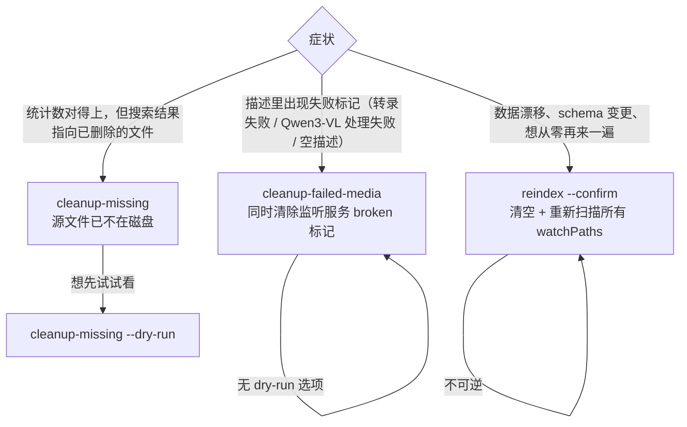

# CLI 命令完整参考

本文记录 `openclaw multimodal-rag` 子命令组的全部 9 个命令。每个命令的参数、默认值、行为分支都来自 `src/cli.ts` 的真实实现。

需要从 Agent 侧调用同样的能力，请参考姊妹文档 [`agent-tools.md`](./agent-tools.md)。

---

## 命令组注册

CLI 注册阶段把所有命令挂在 `program.command("multimodal-rag")` 子命令组下。注册时声明 `commands: ["multimodal-rag"]`，因此插件未启用时这些命令不会出现在 `openclaw --help`。

构造时按需要注入的依赖：

- 嵌入服务：用于 `search`
- 存储层：用于 `search / stats / list / cleanup-missing / cleanup-failed-media`
- 监听服务：用于 `index / cleanup-failed-media / reindex`

---

## 公共解析辅助

CLI 内部沉淀了三类公共解析能力，被多个命令复用：

| 能力 | 行为 |
| --- | --- |
| 结果文件存在性兜底校验 | 对每个候选条目做一次 `stat`；`ENOENT/ENOTDIR` 视为缺失。返回存在与缺失两组，是 `search` / `list` 命令"查询时顺带清理"能力的基础 |
| ISO 日期解析 | 空值视为未传；非字符串报错 `${label} 必须是 ISO 日期字符串`；非法日期报错 `${label} 不是合法日期，示例：2026-02-05T23:59:59` |
| 正整数解析 | 空值时若有默认值则回退；否则报错 `${label} 缺失`；不是 `>= min` 的整数时报错 `${label} 必须是 >= ${min} 的整数` |

> `search` 与 `list` 都包含**失效索引自愈**逻辑：在渲染结果前先做结果文件存在性兜底校验，缺失的立即让存储层做失效索引清理。这与 Agent 工具的行为完全一致。

---

## openclaw multimodal-rag index `<path>`

**用途**：手动触发某个文件或目录的索引；目录会被监听服务递归扫描。

**参数**：

| 参数 / 选项 | 必填 | 默认 | 说明 |
| --- | --- | --- | --- |
| `<path>`（位置参数） | 是 | — | 文件或文件夹路径 |

**示例**：

```bash
# 单个音频
openclaw multimodal-rag index ~/mic-recordings/test.wav

# 整个目录
openclaw multimodal-rag index ~/usb_data/photos
```

**行为**：

1. 触发监听服务对该路径做即时索引，监听服务内部会判断 file/dir 并入队列。
2. 成功打印 `✓ 索引完成: <path>`；失败打印 `✗ 索引失败: <error>` 并以非零状态码退出。

**等价工具**：`media_describe`（针对单文件，可顺带返回 description）。

**源码**：`src/cli.ts:81-93`

---

## openclaw multimodal-rag search `<query>`

**用途**：基于嵌入向量的语义搜索，可叠加类型 / 时间过滤。

**参数**：

| 选项 | 必填 | 默认 | 说明 |
| --- | --- | --- | --- |
| `<query>`（位置参数） | 是 | — | 搜索关键词，会先 `trim`，空串报错 |
| `--type <type>` | 否 | `all` | `image \| audio \| all` |
| `--after <date>` | 否 | — | ISO 日期，例如 `2026-02-03T00:00:00` |
| `--before <date>` | 否 | — | ISO 日期 |
| `--limit <n>` | 否 | `5` | `>= 1` 的整数 |

**示例**：

```bash
openclaw multimodal-rag search "东方明珠"

openclaw multimodal-rag search "上海" \
  --after 2026-02-03T00:00:00 \
  --type image \
  --limit 3
```

**行为**：

1. `trim` 后空串 → 抛 `query 不能为空`。
2. 解析 `--after / --before`，互检顺序，否则抛 `after 不能晚于 before`。
3. 解析 `--limit`（`min=1, default=5`）。
4. 调用嵌入服务生成查询向量。
5. 调用存储层做语义搜索，参数 `{ type, after, before, limit, minScore: 0.3 }`。**CLI 阈值是 0.3**，比 Agent 工具 `media_search` 的 0.25 严一些，避免命令行上太多噪声。
6. 对命中条目做结果文件存在性兜底校验：源文件已删除的让存储层做失效索引清理立刻清掉，并把 `cleanedMissing` 数量打印出来。
7. 渲染：每条输出 `[type] fileName (X%) / 路径 / 时间 / 描述（截断 100 字符）`。
8. 0 命中时打印 `未找到相关媒体文件`，若 `cleanedMissing > 0` 在括号内追加。

**等价工具**：[`media_search`](./agent-tools.md#media_search)（注意 `minScore` 不同）。

**源码**：`src/cli.ts:96-172`

---

## openclaw multimodal-rag stats

**用途**：打印媒体库总数、图片数、音频数；总数与分类和不一致时给出告警。

**参数**：无。

**示例**：

```bash
openclaw multimodal-rag stats
```

**输出**：

```
媒体库统计:
  总计: N 个文件
  图片: N 个
  音频: N 个
  警告: 总数不匹配 (N ≠ X + Y)   # 仅当 total !== imageCount + audioCount 时
```

**行为**：依次让存储层计数全部 / 图片 / 音频，断言 `total === image + audio`，不等时打印 warning。不会显示监听服务的队列状态（这是 Agent `media_stats` 工具的扩展能力）。

**等价工具**：[`media_stats`](./agent-tools.md#media_stats)。

**源码**：`src/cli.ts:175-195`

---

## openclaw multimodal-rag doctor

**用途**：把当前运行时的关键配置和依赖检查结果以 JSON 形式打到 stdout，便于排障。

**参数**：无。

**示例**：

```bash
openclaw multimodal-rag doctor

# 配合 jq 提取
openclaw multimodal-rag doctor | jq '.runtimeConfig'
openclaw multimodal-rag doctor | jq '.deferredWarnings[]'
```

**输出（4 个顶级字段）**：

| 字段 | 类型 | 含义 |
| --- | --- | --- |
| `runtimeConfig` | `object` | `embeddingProvider / whisperProvider / ollamaBaseUrl / ollamaApiKeyConfigured(boolean) / visionModel / embedModel / dbPath`（已经过路径解析） |
| `deferredWarnings` | `string[]` | 运行时可继续启动但建议尽快修复的提示 |
| `watcherStartupBlockers` | `string[]` | 会阻止监听服务启动的硬错 |
| `dependencyHints` | `object` | 包括例如本地 whisper 二进制是否找到等运行依赖建议 |

**行为**：构造一份诊断报告，整体 `JSON.stringify(report, null, 2)` 输出。失败时打 `诊断失败: <error>` 并以非零退出。

**等价工具**：无（doctor 没有暴露给 Agent）。

**源码**：`src/cli.ts:197-209`

---

## openclaw multimodal-rag list

**用途**：列出已索引的媒体条目（按 `fileCreatedAt` 倒序），支持类型 / 时间过滤与分页。

**参数**：

| 选项 | 必填 | 默认 | 说明 |
| --- | --- | --- | --- |
| `--type <type>` | 否 | `all` | `image \| audio \| all` |
| `--after <date>` | 否 | — | ISO 日期 |
| `--before <date>` | 否 | — | ISO 日期 |
| `--limit <n>` | 否 | `20` | `>= 1` 的整数 |
| `--offset <n>` | 否 | `0` | `>= 0` 的整数 |

**示例**：

```bash
openclaw multimodal-rag list

openclaw multimodal-rag list --type audio --limit 50

openclaw multimodal-rag list \
  --after 2026-02-01T00:00:00 \
  --before 2026-02-15T23:59:59 \
  --offset 20 \
  --limit 20
```

**行为**：

1. 解析时间和数字参数，互检 `after <= before`。
2. 调用存储层做列表查询。
3. 做结果文件存在性兜底校验，自动让存储层做失效索引清理。
4. 渲染每条 `[type] fileName / 路径 / 时间 / 描述（截断 80 字符，超出加 ...）`。
5. 当 `total > offset + visibleEntries.length` 追加 `（显示 X-Y，共 N 个）`。
6. 与 Agent 的 `media_list` 不同，**CLI list 不做磁盘兜底**，永远只显示数据库内已索引的条目。

**等价工具**：[`media_list`](./agent-tools.md#media_list)（注意工具默认 `includeUnindexed=true`，CLI 没有）。

**源码**：`src/cli.ts:211-292`

---

## openclaw multimodal-rag cleanup-missing

**用途**：扫描索引，删除"源文件已不存在"的脏条目（即数据库里有记录，但 `stat` 拿不到文件）。

**参数**：

| 选项 | 必填 | 默认 | 说明 |
| --- | --- | --- | --- |
| `--confirm` | 非 dry-run 模式必填 | — | 二次确认；缺失时报错并退出 |
| `--dry-run` | 否 | — | 仅扫描并显示候选，不实际删除 |
| `--limit <n>` | 否 | 全部 | 最多扫描条数；`>= 1` 的整数（无默认值） |

**示例**：

```bash
# 预览：不删除，只看会清掉多少条
openclaw multimodal-rag cleanup-missing --dry-run

# 限制扫描范围
openclaw multimodal-rag cleanup-missing --dry-run --limit 500

# 真正执行
openclaw multimodal-rag cleanup-missing --confirm

# 限制扫描并执行
openclaw multimodal-rag cleanup-missing --confirm --limit 1000
```

**行为**：

1. `dryRun` 与 `--confirm` 互斥逻辑：`!dryRun && !confirm` → 打印提示并退出非零。
2. 解析 `--limit`（无默认值，传了就必须是 `>= 1` 整数）。
3. 让存储层执行失效索引清理，传入 `dryRun` 与 `limit`。
4. dry-run 输出：`✓ 预览完成：扫描 N 条，命中缺失 M 条（未执行删除）`。
5. 执行模式输出：`✓ 清理完成：扫描 N 条，命中缺失 M 条，已删除 K 条`。

**等价工具**：无独立工具，但 `media_search / media_list` 在每次查询时会内置"按命中条目顺带清理"的轻量版逻辑。

**源码**：`src/cli.ts:295-331`

---

## openclaw multimodal-rag cleanup-failed-media

**用途**：清理"描述里写着失败标记"的脏条目（例如转录失败 / 视觉处理失败留下的占位记录），并清掉监听服务维护的 broken-file 标记。

**参数**：

| 选项 | 必填 | 默认 | 说明 |
| --- | --- | --- | --- |
| `--confirm` | 是 | — | 缺失时报错并退出 |

**示例**：

```bash
openclaw multimodal-rag cleanup-failed-media --confirm
```

**行为**：

1. `--confirm` 缺失：打印 `请使用 --confirm 确认清理操作` 并以非零退出。
2. 让存储层删除符合失败描述正则匹配（包括 `转录失败 / Whisper 转录失败 / GLM-ASR 转录失败 / Qwen3-VL processing failed / Empty description from Qwen3-VL`）的条目。
3. 让监听服务清除其内部记下的"反复失败"标记（broken-file 标记）。
4. 输出：`✓ 清理完成：删除 N 条失败媒体记录（候选 X 条），清除 K 个 broken-file 标记`。

**等价工具**：无。

**源码**：`src/cli.ts:336-364`

---

## openclaw multimodal-rag cleanup-failed-audio

**用途**：兼容旧别名，行为完全等同 `cleanup-failed-media`。注册时复用同一份实现，仅命令名与描述不同。

**参数**：与 `cleanup-failed-media` 相同（`--confirm` 必填）。

**示例**：

```bash
openclaw multimodal-rag cleanup-failed-audio --confirm
```

**说明**：保留是为了不破坏老脚本；新脚本请改用 `cleanup-failed-media`。

**源码**：`src/cli.ts:366-370`（注册），`src/cli.ts:333-358`（共享实现）

---

## openclaw multimodal-rag reindex

**用途**：清空整个索引，然后重新扫描所有 `watchPaths`。

**参数**：

| 选项 | 必填 | 默认 | 说明 |
| --- | --- | --- | --- |
| `--confirm` | 是 | — | 缺失时打印两行提示并以非零退出 |

**示例**：

```bash
openclaw multimodal-rag reindex --confirm
```

**行为**：

1. `--confirm` 缺失：打印 `请使用 --confirm 确认重新索引操作` + `警告: 此操作会清空现有索引并重新扫描所有文件`，以非零退出。
2. 打印 `开始完整重新索引...`。
3. 让监听服务执行整体重建（清空 + 重新扫描所有 `watchPaths`）。
4. 完成后打印 `✓ 重新索引完成` 及提示 `提示: 使用 'openclaw multimodal-rag stats' 查看进度`（队列异步消化，`stats` 是观察进度的推荐方式）。

**等价工具**：无。

**源码**：`src/cli.ts:373-393`

---

## 三件套清理命令的选型

`cleanup-missing` / `cleanup-failed-media` / `reindex` 解决三种不同问题，不要混用。



| 命令 | 影响范围 | 是否支持 dry-run | 是否需要 `--confirm` |
| --- | --- | --- | --- |
| `cleanup-missing` | 仅"源文件已被删除"的脏索引 | 是（`--dry-run`） | 非 dry-run 必填 |
| `cleanup-failed-media` | 描述匹配失败标记的索引 + 监听服务 broken 标记 | 否 | 必填 |
| `cleanup-failed-audio` | 同 `cleanup-failed-media` | 否 | 必填 |
| `reindex` | 全库清空 + 重新扫描 | 否 | 必填 |

> 所有非 dry-run 删除命令都强制要求 `--confirm`，避免误操作。

---

## 相关文档

- Agent 工具入口：[`agent-tools.md`](./agent-tools.md)
- 插件总览（配置、运行、部署、排障）：[`../CLAUDE.md`](../CLAUDE.md)
