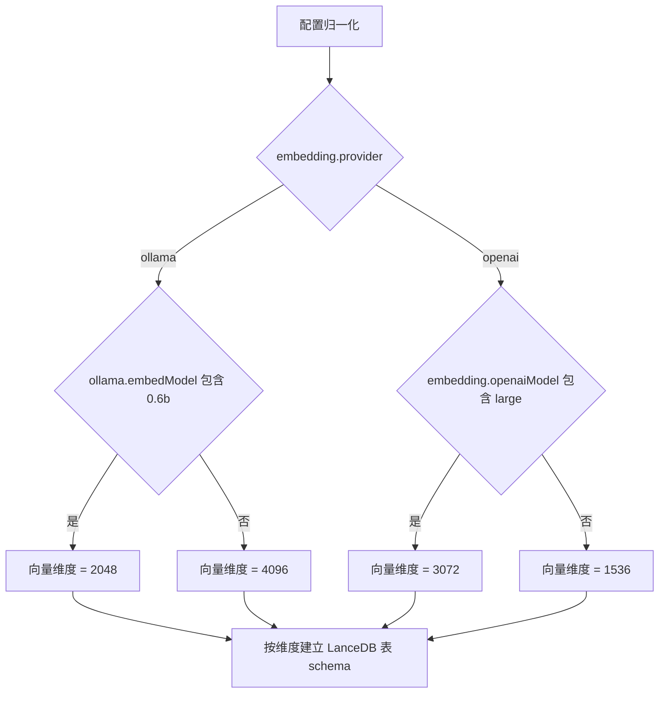
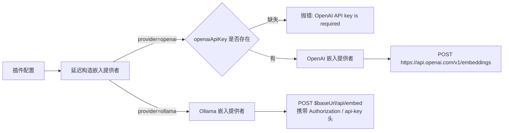
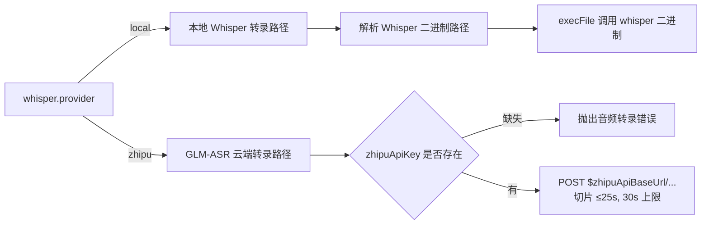
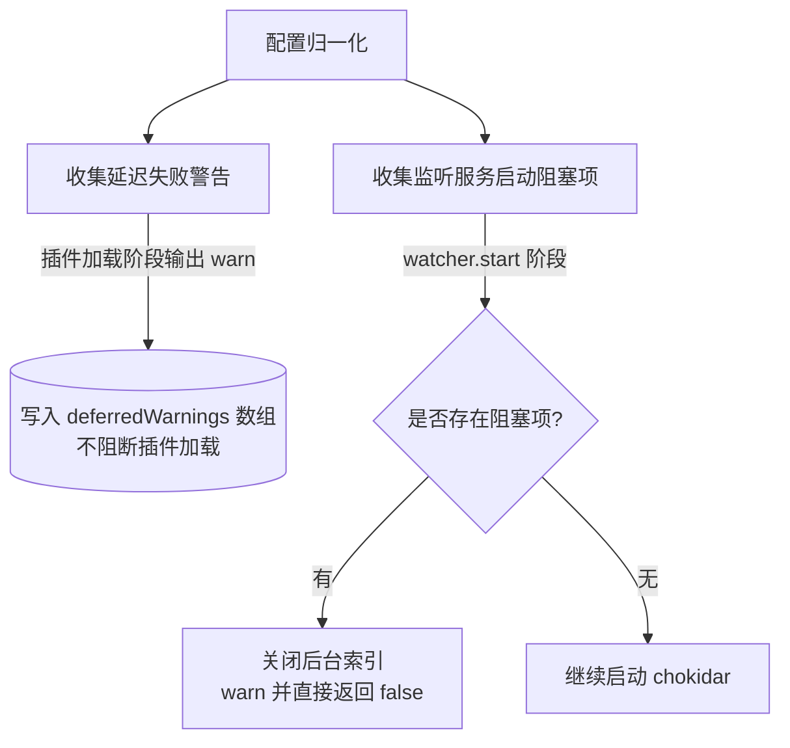

# Multimodal RAG 配置参考

本文档列出 `multimodal-rag` 插件的所有可配置字段、默认值、provider 决策与典型场景。所有字段都来源于代码与 manifest，不存在“计划中”的字段。

> 配套文档：
> - [通知机制](./notifications.md)
> - [运维与故障排查](./operations.md)
> - [架构总览](./architecture.md)

---

## 1. 配置位置

插件配置存放于 OpenClaw 主配置：

```
~/.openclaw/openclaw.json
└── plugins.entries.multimodal-rag.config
```

启用插件本身：

```bash
openclaw config set plugins.entries.multimodal-rag.enabled true --strict-json
```

字段会经过 schema 校验工具做严格校验，未声明的字段会被拒绝（`additionalProperties: false`）。校验通过的对象会进入“配置归一化”流程补齐默认值，最终交给运行时实例化。

> Manifest 中重复声明了一份 JSON Schema，用于 OpenClaw 的设置面板渲染；运行期校验仍以 `src/config.ts` 为准。

---

## 2. 完整配置表

> “默认”列写 `—` 表示该字段没有默认值，必须由用户提供（缺失时由对应分支抛错或仅警告，详见 §4）。

### 2.1 顶层字段

| 路径 | 类型 | 默认值 | 说明 |
|---|---|---|---|
| `watchPaths` | `string[]` | `[]` | 监听目录列表，空数组时 watcher 拒绝启动并打印 warn。支持 `~` 展开。 |
| `dbPath` | `string` | `~/.openclaw/multimodal-rag.lance` | LanceDB 数据库根路径；同时派生 broken-file 标记文件 `${dbPath}.broken-files.json`。 |
| `watchDebounceMs` | `number` | `1000` | chokidar `add`/`change` 去抖窗口（毫秒）。 |
| `indexExistingOnStart` | `boolean` | `true` | chokidar `ignoreInitial` 取反。设为 `false` 时不会触发已存在文件的 `add` 事件，但启动批量扫描仍会运行。 |

> 字段定义集中在 `src/config.ts`；watcher 相关行为见 `src/watcher.ts`。

### 2.2 `fileTypes`

| 路径 | 类型 | 默认值 | 说明 |
|---|---|---|---|
| `fileTypes.image` | `string[]` | `[".jpg", ".jpeg", ".png", ".webp", ".gif", ".heic"]` | 视觉路径接受的扩展名（小写比较）。 |
| `fileTypes.audio` | `string[]` | `[".wav", ".mp3", ".m4a", ".ogg", ".flac", ".aac"]` | Whisper/GLM-ASR 路径接受的扩展名（小写比较）。 |

> 文件类型由扩展名直接判定。修改 `fileTypes` 不会改变现有索引；只影响新事件被分发到 image/audio 哪个处理路径。

### 2.3 `ollama`

| 路径 | 类型 | 默认值 | 说明 |
|---|---|---|---|
| `ollama.baseUrl` | `string` | `http://127.0.0.1:11434` | Ollama 兼容接口的 base URL；既用于嵌入（`/api/embed`）也用于视觉模型（chat completions）。 |
| `ollama.apiKey` | `string?` | — | 远程 Ollama / API 网关时的鉴权。配置后 `Authorization: Bearer <apiKey>` 与 `api-key: <apiKey>` 同时附在所有 Ollama 请求和健康检查上。 |
| `ollama.visionModel` | `string` | `qwen3-vl:2b` | 图像描述模型；走 Ollama chat 接口。 |
| `ollama.embedModel` | `string` | `qwen3-embedding:latest` | 嵌入模型；维度由模型名推断（见 §3）。 |

### 2.4 `embedding`

| 路径 | 类型 | 默认值 | 说明 |
|---|---|---|---|
| `embedding.provider` | `"ollama" \| "openai"` | `"ollama"` | 选择嵌入后端。 |
| `embedding.openaiApiKey` | `string?` | — | `provider=openai` 时必填，缺失时构造嵌入会抛 `OpenAI API key is required when provider=openai`。 |
| `embedding.openaiModel` | `string` | `text-embedding-3-small` | OpenAI 嵌入模型；维度由模型名推断（见 §3）。 |

### 2.5 `whisper`

| 路径 | 类型 | 默认值 | 说明 |
|---|---|---|---|
| `whisper.provider` | `"local" \| "zhipu"` | `"local"` | 音频转录后端。 |
| `whisper.zhipuApiKey` | `string?` | — | `provider=zhipu` 时必填，缺失时 GLM-ASR 调用会抛错。 |
| `whisper.zhipuApiBaseUrl` | `string?` | （回退到 `https://open.bigmodel.cn/api/paas/v4`） | 自定义 GLM-ASR 接入地址。 |
| `whisper.zhipuModel` | `string` | `glm-asr-2512` | GLM-ASR 模型 id。 |
| `whisper.language` | `string` | `zh` | 仅 `provider=local` 使用，作为 Whisper CLI 的 `--language` 参数。 |

### 2.6 `notifications`

| 路径 | 类型 | 默认值 | 说明 |
|---|---|---|---|
| `notifications.enabled` | `boolean` | `false` | 关闭时不会创建通知器，watcher 不携带通知回调。 |
| `notifications.agentId` | `string?` | — | 触发通知的 agent；缺失时按 §通知文档的回退顺序解析。 |
| `notifications.quietWindowMs` | `number` | `30000` | 静默窗口（毫秒）。当前实现只在“无 queued 文件”时立即触发完成通知；该字段值参与 manifest help，但批次结束并发送总结的逻辑不会主动等待该窗口。 |
| `notifications.batchTimeoutMs` | `number` | `600000` | 批次最大超时（毫秒）。首文件入队事件触发时启动一次 `setTimeout` 兜底批次结束。 |
| `notifications.channel` | `string` | `"last"` | agent `--reply-channel` 兜底值。当 `targets[]` 为空且未配置 `to` 时进入 §通知文档第三级回退。 |
| `notifications.to` | `string?` | — | agent `--reply-to` 兜底值。 |
| `notifications.targets` | `Array<{channel,to,accountId?}>` | `[]` | 显式投递列表；非空时优先于 `channel`/`to` 与 session-store 回退。 |

> `notifications` 字段如何驱动 agent 命令、目标解析顺序、批次状态机请见 [notifications.md](./notifications.md)。

---

## 3. provider 分支决策

### 3.1 嵌入维度推断



> 维度参与 LanceDB 表 schema。**变更嵌入模型且新维度与历史维度不同时必须 reindex**，详见 §8 与 [operations.md](./operations.md)。代码位置：`src/runtime.ts`、`src/embeddings.ts`、`src/storage.ts`。

### 3.2 嵌入 provider 调用路径



> 嵌入提供者是“延迟构造”的：插件加载阶段不会真去 ping Ollama/OpenAI；只有第一次调用时才实例化（`src/runtime.ts`）。

### 3.3 Whisper provider 调用路径



> Whisper bin 路径解析逻辑见 §5；GLM-ASR 切片在 `src/processor.ts` 内实现。

---

## 4. 延迟失败警告与启动阻塞项

加载时按两层处理“缺 key”这类问题：



### 4.1 延迟失败警告（仅警告，不阻塞）

“收集延迟失败警告”当前会产出两条警告：

1. `embedding.provider=openai` 但缺 `embedding.openaiApiKey`
2. `whisper.provider=zhipu` 但缺 `whisper.zhipuApiKey`

警告数组挂在 `runtime.deferredWarnings`，会在插件 register 阶段输出 warn 日志，并出现在 `multimodal-rag doctor` 的 `deferredWarnings` 字段。

### 4.2 监听服务启动阻塞项（阻塞 watcher 启动）

“收集监听服务启动阻塞项”当前唯一的阻塞条件：

- `embedding.provider=openai` 但缺 `embedding.openaiApiKey`

其后果是 `watcher.start()` 直接 `return false`，文件监听不启动。已有 LanceDB 表与 CLI（search/list/stats）仍可用，但不会产生新索引。

> 把“缺 OpenAI key”同时塞进警告 **和** 阻塞列表，是因为这条配置在 watcher 上下文里没有合理的运行方式——放到执行时才报错只会污染日志。Whisper key 缺失则只是单文件失败，不会拖垮整个 watcher，因此只产生延迟失败警告。

---

## 5. 环境变量

| 变量 | 作用 | 优先级 |
|---|---|---|
| `OPENCLAW_WHISPER_BIN` | 自定义 Whisper 可执行路径 | 高 |
| `WHISPER_BIN` | 自定义 Whisper 可执行路径（通用形式） | 中 |
| 默认 | 直接调用 PATH 上的 `whisper` | 低 |

仅 `whisper.provider=local` 路径用到该变量。`whisper.provider=zhipu` 不依赖二进制。

---

## 6. Manifest UI 提示速查

manifest 在 `openclaw.plugin.json` 给设置面板提供了字段标签、advanced/sensitive 标记。

- `sensitive: true`（输入框遮蔽）：
  - `ollama.apiKey`
  - `embedding.openaiApiKey`
- `advanced: true`（折叠在“高级”分组）：
  - `dbPath`
  - `watchDebounceMs`
  - `notifications.agentId` / `quietWindowMs` / `batchTimeoutMs` / `channel` / `to` / `targets`

> 通知相关字段统一标 advanced，是为了在“启用通知”这个总开关之外，避免初次配置时把目标列表/兜底渠道直接展开。

---

## 7. 三种典型配置场景

> 三段示例都直接放进 `~/.openclaw/openclaw.json` 的 `plugins.entries.multimodal-rag.config` 即可。完整文件还需要 `plugins.entries.multimodal-rag.enabled = true`。

### 7.1 纯本地 Ollama + 本地 Whisper

适合在内网或开发机直接跑，不依赖任何云端 API。

```json
{
  "watchPaths": ["~/mic-recordings", "~/usb_data"],
  "fileTypes": {
    "image": [".jpg", ".jpeg", ".png", ".webp", ".gif", ".heic"],
    "audio": [".wav", ".mp3", ".m4a", ".ogg", ".flac", ".aac"]
  },
  "ollama": {
    "baseUrl": "http://127.0.0.1:11434",
    "visionModel": "qwen3-vl:2b",
    "embedModel": "qwen3-embedding:latest"
  },
  "embedding": {
    "provider": "ollama"
  },
  "whisper": {
    "provider": "local",
    "language": "zh"
  },
  "dbPath": "~/.openclaw/multimodal-rag.lance",
  "watchDebounceMs": 1000,
  "indexExistingOnStart": true,
  "notifications": {
    "enabled": false
  }
}
```

依赖：本机 `ollama serve` 已运行 + 已 `ollama pull qwen3-vl:2b qwen3-embedding:latest`，`whisper` 在 PATH 中或通过 `OPENCLAW_WHISPER_BIN` 指定。

### 7.2 本地 Ollama + 智谱 GLM-ASR（推荐云端音频）

短音频（30 秒以内）用云端转录更快；图像 + 嵌入仍走本地 Ollama。

```json
{
  "watchPaths": ["~/mic-recordings"],
  "ollama": {
    "baseUrl": "http://127.0.0.1:11434",
    "visionModel": "qwen3-vl:2b",
    "embedModel": "qwen3-embedding:latest"
  },
  "embedding": {
    "provider": "ollama"
  },
  "whisper": {
    "provider": "zhipu",
    "zhipuApiKey": "<ZHIPU_API_KEY>",
    "zhipuModel": "glm-asr-2512"
  },
  "dbPath": "~/.openclaw/multimodal-rag.lance",
  "indexExistingOnStart": true,
  "notifications": {
    "enabled": false
  }
}
```

> GLM-ASR API 限制单次请求 ≤30 秒、≤25MB；超过 30 秒的音频会触发自动切片。如有更长音频，请改回 `whisper.provider=local`。

### 7.3 远程 Ollama 网关 + 智谱 GLM-ASR（带 ollama.apiKey）

用统一 API 网关挡在前面（携带 Bearer Token），其余依赖与 §7.2 相同。

```json
{
  "watchPaths": ["/home/lucy/data"],
  "ollama": {
    "baseUrl": "https://test.unicorn.org.cn/cephalon/user-center/v1/model",
    "apiKey": "<OLLAMA_API_KEY>",
    "visionModel": "qwen3-vl:2b",
    "embedModel": "qwen3-embedding:latest"
  },
  "embedding": {
    "provider": "ollama"
  },
  "whisper": {
    "provider": "zhipu",
    "zhipuApiKey": "<ZHIPU_API_KEY>",
    "zhipuModel": "glm-asr-2512"
  },
  "dbPath": "~/.openclaw/multimodal-rag.lance",
  "indexExistingOnStart": true,
  "notifications": {
    "enabled": true,
    "channel": "last",
    "targets": []
  }
}
```

> 网关如果只暴露 OpenAI 兼容路径（`/v1/models` 而非 `/api/tags`），健康检查会自动回退（详见 [operations.md](./operations.md) §4）。

---

## 8. 配置变更指南

| 修改项 | 是否需要重启 gateway | 是否需要 reindex | 原因 |
|---|---|---|---|
| `watchPaths` | 是 | 否 | watcher 在启动时一次性传给 chokidar，新增/移除路径需要重新 start。 |
| `fileTypes.*` | 是 | 否 | 支持的扩展名集合在启动时计算。 |
| `embedding.provider` 切换 | 是 | 视维度而定 | 维度变化（如从 `qwen3-embedding`(4096) 切到 `text-embedding-3-small`(1536)）时 LanceDB 表 schema 不兼容。 |
| `embedding.openaiModel` 跨“large”切换 | 是 | 是 | 维度从 1536 ↔ 3072 变化。 |
| `ollama.embedModel` 跨“0.6b”切换 | 是 | 是 | 维度从 4096 ↔ 2048 变化。 |
| `ollama.visionModel` | 是 | 否 | 描述变了，但向量维度不变；如果想让旧文件也用新模型，可手工 `multimodal-rag reindex --confirm`。 |
| `whisper.provider`、`whisper.zhipuModel` | 是 | 否（同上，可选） | |
| `dbPath` | 是 | 不适用（指向了一个新数据库） | broken-file 标记路径会一并切换。 |
| `notifications.*` | 是 | 否 | 通知器是在 runtime 构造期决定是否创建。 |

> reindex 操作是“清表 + 重新扫描”：详见 [operations.md](./operations.md)。

---

## 9. 附录：`openclaw config set` 命令清单

> 本节从 `docs/legacy/multimodal-rag-config-set-commands.md` 迁移过来。每条命令都已对照当前 `src/config.ts` 与 `openclaw.plugin.json` 校对：所有 key 仍存在。

请先把占位符替换成真实值：

- `<OLLAMA_API_KEY>`
- `<ZHIPU_API_KEY>`

### 9.1 启用插件

```bash
openclaw config set plugins.entries.multimodal-rag.enabled true --strict-json
```

### 9.2 基础配置

```bash
openclaw config set plugins.entries.multimodal-rag.config.watchPaths '["/home/lucy/data"]' --strict-json
openclaw config set plugins.entries.multimodal-rag.config.ollama.baseUrl '"https://test.unicorn.org.cn/cephalon/user-center/v1/model"' --strict-json
openclaw config set plugins.entries.multimodal-rag.config.ollama.apiKey '"<OLLAMA_API_KEY>"' --strict-json
openclaw config set plugins.entries.multimodal-rag.config.ollama.visionModel '"qwen3-vl:2b"' --strict-json
openclaw config set plugins.entries.multimodal-rag.config.ollama.embedModel '"qwen3-embedding:latest"' --strict-json

openclaw config set plugins.entries.multimodal-rag.config.embedding.provider '"ollama"' --strict-json

openclaw config set plugins.entries.multimodal-rag.config.whisper.provider '"zhipu"' --strict-json
openclaw config set plugins.entries.multimodal-rag.config.whisper.zhipuApiKey '"<ZHIPU_API_KEY>"' --strict-json
openclaw config set plugins.entries.multimodal-rag.config.whisper.zhipuModel '"glm-asr-2512"' --strict-json

openclaw config set plugins.entries.multimodal-rag.config.dbPath '"~/.openclaw/multimodal-rag.lance"' --strict-json
openclaw config set plugins.entries.multimodal-rag.config.indexExistingOnStart true --strict-json
```

### 9.3 通知配置

```bash
openclaw config set plugins.entries.multimodal-rag.config.notifications.enabled false --strict-json
openclaw config set plugins.entries.multimodal-rag.config.notifications.quietWindowMs 30000 --strict-json
openclaw config set plugins.entries.multimodal-rag.config.notifications.batchTimeoutMs 600000 --strict-json
openclaw config set plugins.entries.multimodal-rag.config.notifications.channel '"last"' --strict-json
openclaw config set plugins.entries.multimodal-rag.config.notifications.targets '[]' --strict-json
```

### 9.4 验证

```bash
openclaw config validate
openclaw multimodal-rag doctor
```

> `doctor` 命令的字段含义见 [operations.md](./operations.md)。
