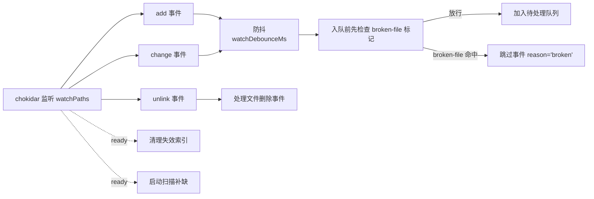
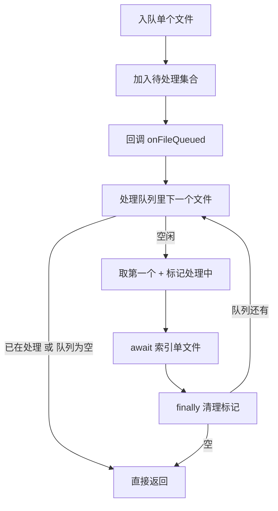
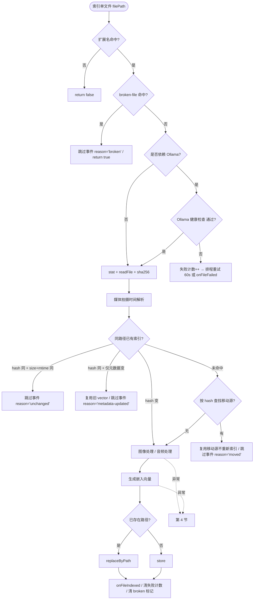
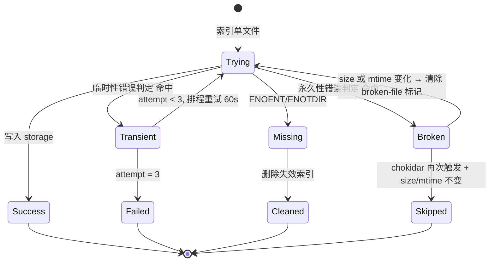
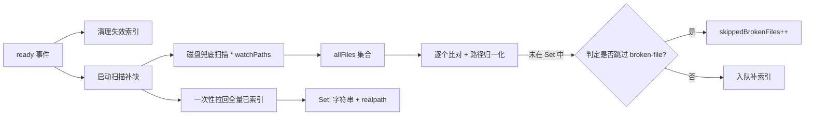
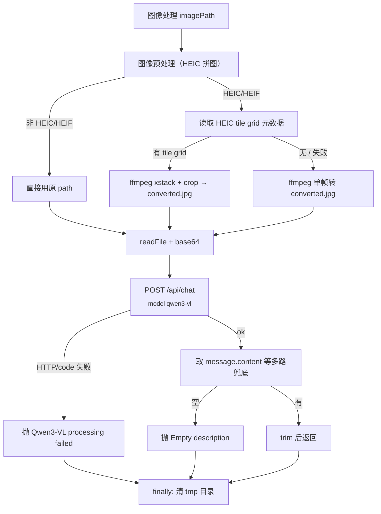
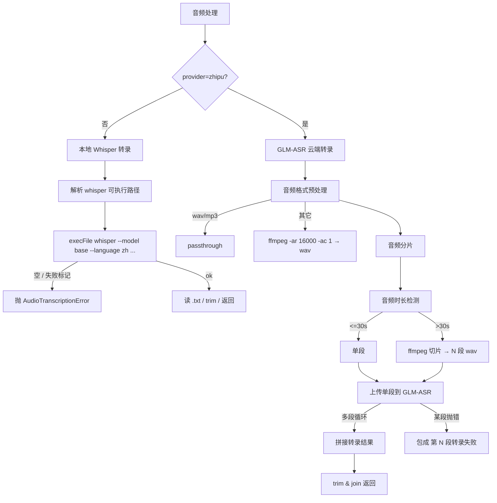
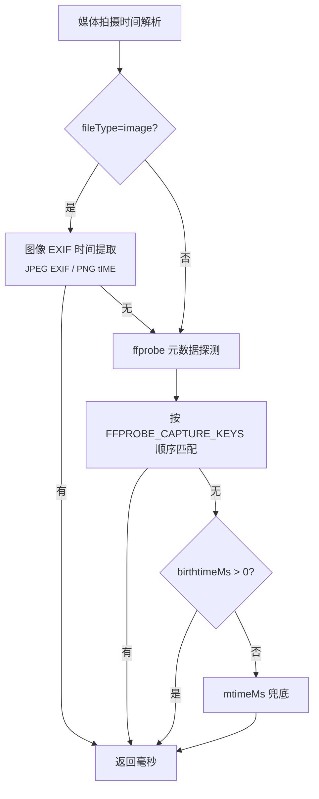

# Multimodal-RAG 索引主链路（indexing-pipeline）

本文按照"事件入口 → 队列 → 单文件主流程 → 重试 → 删除/移动 → 启动自愈 → 媒体子链路 → 时间戳 → embedding → notifier"的顺序，
描述 multimodal-rag 插件把磁盘文件落入向量库的完整链路。

存储层细节（schema、分页、cleanup、auto-optimize 等）见同目录 `storage.md`，
本文不重复。检索链路见 `search-and-retrieval.md`，对外工具语义见 `agent-tools.md`，运维命令见 `operations.md`。

---

## 1. 入口：chokidar 三种事件 + debounce

启动文件监听时，watcher 会把配置中的 `watchPaths` 先做一次"`~/` 展开为
`homedir()`"的路径归一化，再交给 chokidar 监听。整个监听服务由 watcher 模块
负责管理（参见 `src/watcher.ts:52-60, 123-141`）。

启动前两个早退条件：

- `embedding.provider === "openai"` 但缺 `embedding.openaiApiKey` → 直接关闭后台
  索引并 `warn`。
- `watchPaths.length === 0` → 同样关闭，记 warn（参见 `src/watcher.ts:102-112`）。

启动前还会一次性把磁盘上的 `${dbPath}.broken-files.json` 加载进内存的
broken-file 状态表（参见 `src/watcher.ts:114, 1072-1101`）。

chokidar 选项关键点：

- `ignored`：忽略隐藏文件（`.` 开头），但显式放行"watchPath 自身或父目录"，
  避免 `~/.openclaw/...` 被误杀。
- `ignoreInitial: !indexExistingOnStart`，决定是否在 `ready` 之前就发 `add`
  事件给已存在的文件。
- `awaitWriteFinish.stabilityThreshold = 2000` / `pollInterval = 100`，避免文件
  还在写入时就开始处理（参见 `src/watcher.ts:126-140`）。

监听的事件只关心三种：

| 事件     | 行为                                                                                                                          |
| -------- | ----------------------------------------------------------------------------------------------------------------------------- |
| `add`    | 扩展名命中 `image+audio` 列表 → 清掉同 path 的旧 debounce timer → `setTimeout(watchDebounceMs)` → 入队前先检查 broken-file 标记 |
| `change` | 与 `add` 完全相同的去抖+入队逻辑                                                                                              |
| `unlink` | 异步走"处理文件删除事件"，不进队列也不 debounce                                                                               |

不在 `image + audio` 配置里的扩展名直接被丢弃（参见 `src/watcher.ts:143-189`）。

ready 事件触发两件后台任务："清理失效索引"和"启动扫描补缺"，两者都
fire-and-forget，不阻塞监听。`error` 事件只 warn 一次，不重启 watcher
（参见 `src/watcher.ts:191-209`）。



---

## 2. 队列模型：单 worker 串行

队列只有两个状态字段：

- 待处理路径集合（一个 `Set<string>`）。
- 标记是否已有 worker 在跑的布尔位。
- 当前正在处理的路径单独保存一份，仅供 `media_stats` 工具暴露给外部
  （参见 `src/watcher.ts:67-69, 767-772`）。

入队动作把 path 加到 Set，触发 `onFileQueued` 回调，然后立刻调度"处理队列里
下一个文件"（参见 `src/watcher.ts:244-249`）。

调度逻辑是整套队列的唯一调度点，行为可以拆成四步：

1. 若已在处理中或队列为空 → 直接返回，保证全局只有一个 worker。
2. 否则从 Set 取第一个 path（`Set.values().next().value`），从 Set 删除，
   把"正在处理"标志和当前路径都设上。
3. `await` 索引单文件流程，外层 `try/catch` 兜底——任何抛错都只 warn，不污染
   队列。
4. `finally` 里把"正在处理"标志复位、清掉当前路径，并在队列还有剩余时递归
   再调度一次（参见 `src/watcher.ts:426-455`）。

也就是说：**整个插件实例任意时刻只有一个媒体文件在被处理**，无论队列里堆了
多少。这是给 GPU/Whisper 留资源的有意设计，不会改成并发。



`stop()` 时清掉所有 timer/Set/Map，并调用 `callbacks.dispose?.()`
（参见 `src/watcher.ts:217-239`）。

`reindexAll()` 是另一条极少用的入口：清空 storage、清空内存队列与失败/移动
缓存，然后跑"启动扫描补缺"把全部 watchPath 重新入队（参见
`src/watcher.ts:973-991`）。它不会清 `broken-files.json`，所以历史 broken
标记仍有效——这点与 `cleanup-failed-media` CLI 命令的"清除 broken-file 标记"
形成互补，详见 `operations.md`。

---

## 3. 单文件索引主流程

索引单文件流程是真正干活的方法。按顺序它做这些事：

1. **扩展名识别** — `extname()` 比对 `fileTypes.image / audio`，识别为
   `image | audio`，否则直接 `return false`（不算失败）。
2. **结构化日志** — 写一条 `event=index_file_start` 事件，附 `filePath /
   fileType / provider`。
3. **broken-file 早退** — 见第 4 节。
4. **Ollama 健康预检** — 仅在"判定文件是否依赖 Ollama"返回 true 时才检查。
5. **元数据读取** — `stat() + readFile() + sha256`，再走"媒体拍摄时间解析"
   拿真实拍摄时间。
6. **同路径一致性比对** — 按 path 查现有索引行，三种分支：unchanged / 仅
   元数据更新 / 重新处理。
7. **Move-reuse 检测** — 路径不存在时按 hash 查找移动源，见第 6 节。
8. **媒体处理** — 走"图像处理"或"音频处理"。音频文本会再过一次
   `AUDIO_FAILURE_PATTERN` 防御性校验，避免历史版本写入的 "(转录失败:..."
   字符串再次落库。
9. **嵌入向量** — 调用 embedding 服务把 description 转成向量。
10. **写入** — 已存在路径走 `replaceByPath`，新路径走 `store`。
11. **成功收尾** — 写 `event=index_file_success` 日志、清失败计数、清
    broken-file 标记、回调 `onFileIndexed`（参见 `src/watcher.ts:508-723`）。



CLI 命令 `multimodal-rag index <path>` 走的是另一个入口：给目录会先递归扫描，
再对每个文件顺序索引并最后聚合错误抛出；给单文件就直接索引一次。它不经
chokidar，但跑的就是同一份索引单文件流程，所有重试 / broken-file / move-reuse
逻辑同样生效（参见 `src/watcher.ts:728-762`）。

### 3.1 同路径一致性的三种分支

| 旧索引行与新文件比对                                | 行为                                                        |
| ---------------------------------------------------- | ----------------------------------------------------------- |
| `fileHash` 同 + `fileSize` 同 + `fileModifiedAt` 同 | 发"跳过事件 reason='unchanged'"直接返回                     |
| `fileHash` 同但 size/mtime 任一不同                 | 复用旧 description+vector，仅 `replaceByPath` 更新元数据，发"跳过事件 reason='metadata-updated'" |
| `fileHash` 变了                                     | 走完整重新处理：媒体处理 → 嵌入 → `replaceByPath`           |

第二种分支是为了应对"用户用 `touch` 改了 mtime"或"系统迁移文件保留 mtime
抖动"之类不需要重跑模型的情况（参见 `src/watcher.ts:572-603`）。

### 3.2 Ollama 仅在必要时被探活

"判定文件是否依赖 Ollama"的语义：

- `image` 一律返回 `true`（图像描述跑 Qwen3-VL，必须 Ollama）。
- `audio` 仅当 `embedding.provider === "ollama"` 时才返回 `true`。

也就是说，配 `embedding.provider="openai"` + `whisper.provider="zhipu"` 的
纯云端组合下，音频文件根本不需要本地 Ollama 服务，预检会被跳过
（参见 `src/watcher.ts:416-421`）。

Ollama 健康检查的行为：

1. 60s 缓存窗口：若上次成功不超过 60 秒就直接命中缓存。
2. 把 `ollama.apiKey` 同时塞到 `Authorization: Bearer ...` 和 `api-key` 两个
   header（兼容 Ollama 原生与 user-center 代理）。
3. 5s 超时去打 `${baseUrl}/api/tags`；返回 ok 即视为健康。
4. 若 `/api/tags` 返回 404，回退打 `${baseUrl}/v1/models`（适配 user-center
   代理）。
5. 任何失败/异常都把健康标志置否，下一轮再试。

健康检查失败时不直接抛错，而是给当前 file 计一次 attempt：未到 3 次就排程
重试 60 秒，到 3 次走 `onFileFailed`（参见 `src/watcher.ts:539-562, 923-968`）。

---

## 4. 重试与错误分类

错误分两步处理：先按字符串特征做粗分类打日志标签，再用"临时性错误判定"
决定是否重试（参见 `src/watcher.ts:303-318, 1049-1061`）。

临时性错误判定命中下列任一关键字（小写匹配）即视为可恢复，重试 3 次、每次
间隔 60s：

```
internal server error / ollama / econnrefused / econnreset /
etimedout / fetch failed / timeout / aborted
```

非临时错误走"标记文件为 broken-file"：把 `{ size, mtimeMs, error, markedAt }`
持久化到 `${dbPath}.broken-files.json`，然后 `onFileFailed` 通知上层。下一次
chokidar 再发同 path 的 add/change，"入队前先检查 broken-file 标记"会执行
"判定是否跳过 broken-file"：

- 如果当前 `stat` 出来的 `size + mtimeMs` 都和 marker 一致 → 跳过、报
  `onFileSkipped 'broken'`，永远不再尝试。
- 如果 size 或 mtime 任一变了 → 视为"用户已修复"，清除 broken-file 标记并
  放行入队（参见 `src/watcher.ts:1063-1169`）。

文件缺失（`ENOENT/ENOTDIR`）是特殊路径：索引主流程里捕获到这两个 errno 时，
会调"删除失效索引"把可能残留的索引行删掉、清 broken-file 标记、清 failed
计数，并发 `onFileSkipped 'deleted'`，整体当成功处理。这避免了"用户先 touch
后 rm 的赛跑"残留 broken 标记（参见 `src/watcher.ts:670-681`）。



排程重试本质上只是个 `setTimeout`，回调里把 path 重新入队。所有 timer 都
收在 `this.retryTimers` 里，`stop()` 时一并清空（参见 `src/watcher.ts:408-414`）。

---

## 5. 删除同步：处理文件删除事件

unlink 事件触发"处理文件删除事件"，依次做：

1. 先做"清理过期的最近删除快照"，把 TTL 60s 之外的 snapshot 清出去。
2. 推断 `fileType`（按扩展名落入 image 还是 audio 配置）。
3. 把 path 上的 debounce timer 清掉、从待处理集合里删掉、从失败计数表里清
   掉。如果之前确实在队列里，发 `onFileSkipped 'deleted'`。
4. 按 path 取出旧条目；找到就执行"记录最近删除快照"，把
   `{ entry, deletedAt: now, sourcePath }` 推到按 hash 索引的数组里。这就是
   给"move-reuse"留的 60s 短期窗。
5. 走"删除失效索引"删除存储里这条索引：先按字符串相等 `storage.deleteByPath`；
   删 0 条时进入 fallback——遍历全表把每条 path 都做一次 `realpath` 归一化，
   碰到归一化后等价的就单独 `storage.delete(id)`。这覆盖了软链/绝对路径
   别名导致字符串不等的情况。
6. 顺手清掉这条 path 上残留的 broken-file marker
   （参见 `src/watcher.ts:262-288, 333-344, 847-871`）。

`recentlyDeletedEntryTtlMs = 60_000` 是关键节流参数：unlink 后 60s 内重新
add 同 hash 的文件，会命中 move-reuse 路径，跳过模型与 embedding
（参见 `src/watcher.ts:23, 75`）。

---

## 6. Move-reuse：移动文件的关键节流

很多客户端（rsync、imessage 同步、相册整理）会用"先 unlink 旧 path、再 add
新 path"的模式搬文件。如果每次都重跑 Qwen3-VL + embedding，几百张照片的
迁移会卡住整个队列几十分钟。watcher 用"按 hash 查找移动源"做了显式优化。

### 6.1 候选源

按 hash 查找移动源时按下面两个优先级找候选：

1. **缓存源**：从最近删除快照表里倒序取（最近删除的先用），`fileType` 必须
   一致；再用"路径归一化"+磁盘存在性校验候选的旧路径确实在磁盘上不存在了。
   命中即返回 `{ entry, source: "cache" }`。
2. **存储源**：调存储层拿所有 hash 相同的历史条目；同样要求 `fileType` 一致
   并且旧路径不存在。命中即返回 `{ entry, source: "storage" }`。

两路都做磁盘存在性二次确认：不能把"原文件还在 + 用户手动复制了一份"误判成
move（参见 `src/watcher.ts:361-406`）。

### 6.2 复用动作

只有"同路径已有索引"为空（即新路径在索引里完全没出现过）时才会触发
move-reuse 检查。命中后跑"复用移动源不重新索引"：

1. 如果旧 entry 的 path 与新 path 不同，先尝试 `storage.delete(oldId)`，失败
   时降级到 `storage.deleteByPath(oldPath)`，确保不会留双份。
2. `storage.replaceByPath` 写入新 path，但 `description / vector` 完全沿用
   旧 entry，仅 `fileHash / fileSize / fileCreatedAt / fileModifiedAt` 用新值。
3. 走"消费最近删除快照"把这条 snapshot 从内存缓存中按 id+sourcePath 双键
   删除，避免下一次 add 同 hash 又复用同一条。
4. 清失败计数 / 清 broken marker / 发 `onFileSkipped 'moved'` / 写结构化日志
   `event=index_file_moved_reused`（含 `reusedFromPath / source / durationMs`）
   （参见 `src/watcher.ts:346-359, 457-503, 605-620`）。

整个过程不调 Qwen3-VL、不调 Whisper、不调 embedding——纯粹是数据库重写。
对照"完整索引"的 5–15s 量级，这条路径通常是亚秒级。

> 节流前提：**60s TTL 内**先收到 unlink 才有 cache 命中；超过 60s 但 storage
> 里仍能按 hash 找到一条 path 不存在的旧记录，仍然能走 storage 源复用。

---

## 7. 启动自愈：scan + cleanup

watcher.ready 事件并发触发两条自愈链路。

### 7.1 清理失效索引

直接转调 `storage.cleanupMissingEntries({ dryRun: false, limit })`，删掉所有
"索引行还在但磁盘上 ENOENT/ENOTDIR"的条目。结束后写一条
`event=cleanup_missing_entries_completed: scanned=... missing=... removed=...`
日志。`limit` 可省略，默认全表扫（参见 `src/watcher.ts:993-1012`）。

### 7.2 启动扫描补缺

性能关键路径，避免 N 次数据库查询：

1. 对所有 `expandedPaths` 做"磁盘兜底扫描"（递归 + 跳隐藏文件 +
   `supportedExts` 过滤）拼出 `allFiles`。
2. 一次性 `storage.listAllEntries()` 拉回全量已索引条目（不含 vector，省
   内存）。
3. 把已索引 path **同时**按字符串原值和 `realpath` 归一化值塞进
   `indexedPathsSet`，防漏判。
4. 把 `allFiles` 也批量做"路径归一化"，得到可比对集合。
5. 对比：`indexedPathsSet` 不包含的那些 path 才视为 missing；missing 又要
   先过"判定是否跳过 broken-file"，已 broken 且文件没变的不再入队。
6. missing 的 enqueue，broken 的累积成 `skippedBrokenFiles` 计数，最后写
   `Found X missing files out of Y total` 日志（参见
   `src/watcher.ts:777-918`）。



之所以双向 realpath 归一化，是因为索引 path 可能是绝对路径但实际文件位于
软链下（例如 `~/Pictures` → `/Volumes/Photos`）。不归一化会把"软链 path"和
"真实 path"误判为两条不同的 missing。

---

## 8. 媒体处理子链路（processor.ts）

媒体处理器把图像与音频都收敛成"返回一段中文 description"
（参见 `src/processor.ts:67-689`）。

### 8.1 图像：Qwen3-VL via Ollama /api/chat

图像处理主流程：

1. 先做"图像预处理（HEIC 拼图）"决定是直接读原文件，还是先用 ffmpeg 转出
   jpg。
2. `readFile + base64`，构造一段固定中文 prompt：要求模型描述场景/人物物体
   建筑/文字标识/时间线索/情感氛围。
3. headers 同样把 `apiKey` 双写到 `Authorization: Bearer` 和 `api-key`。
4. POST 到 `${baseUrl}/api/chat`，body 是 `{ model, messages: [{ role: "user",
   content, images: [base64Image] }], stream: false }`。
5. 失败处理：
   - HTTP 非 ok → 抛 `Qwen3-VL processing failed: HTTP <status>, detail=<前
     240 字>`。
   - 业务码 `data.code` 存在且非 `"0"` → 抛 `code=<...>, msg=<...>`（兼容
     user-center 代理回包格式）。
   - description 取值兜底依次是 `data.message.content` /
     `data.data.message.content` / `data.choices[0].message.content`，全空就抛
     `Empty description from Qwen3-VL`。
6. `finally` 调预处理产物的 `cleanup()` 删 ffmpeg 输出的 tmp 目录
   （参见 `src/processor.ts:78-163`）。

#### 8.1.1 HEIC/HEIF 子流程：tile-grid via ffmpeg xstack

iPhone 拍出来的 HEIC 在硬件层是按 tile 拆开存的；如果不重组直接喂 ffmpeg，
得到的会是某一个 tile 而不是整张图。"图像预处理（HEIC 拼图）"专门处理 HEIC/
HEIF：

1. `mkdtemp("multimodal-rag-image-")` 准备 tmp 目录。
2. "读取 HEIC tile grid 元数据"会跑 `ffprobe -show_stream_groups`，从 JSON
   里挑出 `type` 包含 "tile grid" 的 group，读出 `components[0].width/height`
   与每条 `subcomponents[].{stream_index, tile_horizontal_offset,
   tile_vertical_offset}`。tile 列表按 `(y, x)` 排序，便于 layout。
3. **tile-grid 拼接路径**：tiles 数组非空时，构造 ffmpeg 滤镜：
   - inputs：`[0:v:<index>] ... xstack=inputs=N:layout=x_y|x_y|...:fill=black`
   - 末尾再 `crop=W:H:0:0[out]` 裁回原始宽高。
   - `ffmpeg -i imagePath -filter_complex <filter> -map [out] -frames:v 1
     -update 1 converted.jpg`。
4. **fallback 路径**：tile-grid 取不到（ffprobe 失败 / 不是 tile-grid 编码）
   时，跑普通的 `ffmpeg -i ... -frames:v 1 -update 1 converted.jpg`，把 HEIC
   当成单帧编码处理。
5. ffmpeg 找不到时抛 `HEIC/HEIF conversion failed: ffmpeg not found in PATH`，
   其它异常会包成 `HEIC/HEIF conversion failed: ...`。
6. 不论成败，最后都 `rm -rf tempDir`（参见 `src/processor.ts:165-307`）。

非 HEIC/HEIF 路径直接返回 `{ path: imagePath, cleanup: noop }`，零开销。



### 8.2 音频：本地 Whisper

音频处理根据 `whisperConfig.provider` 路由：`"zhipu"` 走云端，其他走"本地
Whisper 转录"。

本地 Whisper 转录做的事：

1. `mkdtemp("whisper-")` 准备输出目录。
2. 解析 whisper 可执行路径——`OPENCLAW_WHISPER_BIN` > `WHISPER_BIN` > 字面量
   `"whisper"`（参见 `src/whisper-bin.ts:6-18`）。
3. `execFile(whisperBin, [audioPath, "--model", "base", "--language",
   <language||"zh">, "--output_format", "txt", "--output_dir", tempDir])`，
   `maxBuffer = 10 MiB`。
4. 期望产物路径：`tempDir/<basename without ext>.txt`。读不到时 fallback 到
   `${stdout}\n${stderr}` 拼起来。
5. `trim()` 后做两层校验：空字符串 → 抛 `Whisper 未输出有效转录文本`；命中
   `AUDIO_FAILURE_PATTERN`（`/^[（(]\s*转录失败[:：]/`）→ 抛
   `Whisper 返回了失败标记文本`。
6. 异常分类：`ENOENT` → `找不到 whisper 命令，请先安装 whisper 并确保 ffmpeg
   可用`；其它 → `Whisper 转录失败: ...`。所有失败都用
   `AudioTranscriptionError` 类型抛出。
7. `finally` 删 tmp 目录（参见 `src/processor.ts:309-313, 622-688`）。

### 8.3 音频：智谱 GLM-ASR 云端

GLM-ASR API 硬性限制：单次请求 ≤ 25 MB、≤ 30 秒，且只接 `wav / mp3`。
"GLM-ASR 云端转录"围绕这些限制做了三层适配：

1. **"音频格式预处理"** —— 扩展名属于 `ZHIPU_SUPPORTED_AUDIO_EXTS = { .wav,
   .mp3 }` 直接 passthrough。否则 `mkdtemp("zhipu-asr-")`，跑 `ffmpeg -i
   audioPath -ar 16000 -ac 1 converted.wav` 转成 16kHz 单声道 wav；ffmpeg
   缺失时抛 `音频格式转换失败: ffmpeg not found in PATH`。
2. **"音频分片"** —— 先做"音频时长检测"跑 `ffprobe -show_entries
   format=duration` 拿浮点秒数；ffprobe 缺失时返回 `null`，直接跳过切片
   （让后续 API 自己报错）。时长 `≤ ZHIPU_MAX_AUDIO_SECONDS = 30` → 单段
   返回。时长超阈值 → "音频切片"跑 ffmpeg `-f segment -segment_time 25
   -reset_timestamps 1 -ar 16000 -ac 1 -c:a pcm_s16le` 把音频按 25s 切成
   若干 wav，文件名形如 `<base>-000.wav, <base>-001.wav, ...`。
3. **"上传单段到 GLM-ASR"** —— 每段读成 Buffer，按扩展名选 mime（`.mp3 →
   audio/mpeg`，否则 `audio/wav`），用 `FormData + fetch` 多部分 POST 到
   `${zhipuApiBaseUrl||ZHIPU_DEFAULT_API_BASE}/audio/transcriptions`。必填
   字段：`file` / `model`（`zhipuModel || "glm-asr-2512"`）/ `stream=false`。
   HTTP 非 ok 抛 `GLM-ASR 转录失败: HTTP <status> - <前 240 字>`，带
   `AudioTranscriptionError`。`data.text` 为空抛 `GLM-ASR 未返回有效转录文本`；
   命中失败标记正则同样抛错。
4. **"拼接转录结果"** 把每段 trim 后用空格 join。多段中只要任意一段抛
   `AudioTranscriptionError`，外层会包成 `GLM-ASR 第 N 段转录失败: <原
   message>` 重新抛出，方便日志定位。
5. `finally` 双层 cleanup：先清 segments tmp 目录，再清格式转换 tmp 目录
   （参见 `src/processor.ts:344-617`）。



### 8.4 失败标记的两道闸门

为什么图像/音频处理代码里到处都在过 `AUDIO_FAILURE_PATTERN`：历史上有版本
把 "(转录失败:..." 当成正常 description 写进了向量库，后续搜索就一直能搜到
一堆垃圾。现在 watcher、processor、storage 三层都在拦：

- 索引主流程拿到 description 后过一次，命中就抛错走重试 / broken 路径。
- processor 在 Whisper / GLM-ASR 两路都过一次，命中就抛
  `AudioTranscriptionError`。
- 存储层的 `cleanupFailedMediaEntries` 用 `FAILED_MEDIA_DESCRIPTION_PATTERNS`
  做了一组更宽的正则（含 `Whisper 转录失败` / `GLM-ASR 转录失败` /
  `Qwen3-VL processing failed` / `Empty description from Qwen3-VL`），能一键
  清掉历史脏数据，CLI 命令是 `multimodal-rag cleanup-failed-media`（详见
  `storage.md` 与 `operations.md`）（参见 `src/watcher.ts:629-631`、
  `src/processor.ts:415-417, 665-667`）。

---

## 9. 媒体时间戳解析（media-timestamps.ts）

"媒体拍摄时间解析"按下面顺序拿"真正的拍摄时间"，找不到才回退到文件系统时间：

1. **图像分支**（`fileType === "image"`）：
   - `readFile(filePath)` 读全量字节，调"图像 EXIF 时间提取"：
     - `.jpg / .jpeg`：扫 EXIF APP1 段，按 IFD0 + Exif SubIFD（tag `0x8769`）
       解 `DateTimeOriginal(0x9003) / DateTimeDigitized(0x9004) /
       DateTime(0x0132)`，三个标签里任一有效就用。字符串 `"YYYY:MM:DD HH:MM:SS"`
       走 `parseExifDateString` 解析（保留本地时区，因为 EXIF 没存时区，按
       `new Date(year, month-1, ...)` 当本地时间用）。
     - `.png`：按 PNG chunk 协议扫到 `tIME` chunk（length=7），读 `year(BE16),
       month, day, hour, minute, second`，用 `Date.UTC(...)` 拼成 UTC 毫秒。
       PNG 标准里 `tIME` 是 UTC，所以这里是唯一一个走 `Date.UTC` 的分支。
     - 其它扩展名（webp / gif / heic / heif 等）一律返回 `undefined`，留给
       下一步 ffprobe 补救。
   - 整个图像分支被 `try { ... } catch {}` 包着，读文件失败也只是降级到下
     一步（参见 `src/media-timestamps.ts:37-212`）。
2. **ffprobe tags 分支**（任何 fileType 都跑）：
   - "ffprobe 元数据探测"跑 `ffprobe -print_format json -show_entries
     format_tags:stream_tags`，把 `format.tags` 与每个 `streams[].tags` 合并。
   - 把所有 key 转小写，按 `FFPROBE_CAPTURE_KEYS` 顺序找：`creation_time /
     date_time_original / datetimeoriginal / datetime_original / date /
     creationdate / com.apple.quicktime.creationdate / date:create`，第一个能
     `parseExifDateString` 解出来的就用。
   - 这一步覆盖音频（wav/mp3/m4a 的 `creation_time`）以及非 jpg/png 图像
     （webp/heic 的 ffmpeg metadata）（参见 `src/media-timestamps.ts:225-243`）。
3. **birthtimeMs**：`Number.isFinite(stats.birthtimeMs) && > 0` 时返回。
   Linux 某些 fs 没有 birthtime 会给 `0`，所以有上面的额外校验。
4. **mtimeMs**：最后兜底（参见 `src/media-timestamps.ts:277-309`）。



> 注意：拍摄时间解析接受 `deps = { readFile?, probeTags? }` 注入，主要是为
> 了测试。生产里默认就是 fs.promises 与 ffprobe。

---

## 10. Embedding 抽象（embeddings.ts）

"嵌入服务工厂"按 `config.provider` 选实现：

| provider | 实现             | 默认 baseUrl/model                                  |
| -------- | ---------------- | --------------------------------------------------- |
| `ollama` | Ollama 嵌入服务  | `http://127.0.0.1:11434` / `qwen3-embedding:latest` |
| `openai` | OpenAI 嵌入服务  | `https://api.openai.com` / `text-embedding-3-small` |

`provider="openai"` 但缺 `openaiApiKey` 时工厂直接抛 `OpenAI API key is
required when provider=openai`，与 watcher 启动时的 openai key 早退是双层
防护（参见 `src/embeddings.ts:126-150`）。

### 10.1 Ollama 嵌入服务

主流程：

1. 重试 3 次，间隔 `retryDelay * attempt`（递增退避：1s、2s）。
2. headers 同样把 `apiKey` 双写到 `Authorization: Bearer` 和 `api-key`。
3. POST `${baseUrl}/api/embed`（**新版 endpoint**，兼容 Ollama ≥ 0.4 与
   user-center 代理）。
4. 响应解析按"先新版后旧版"兜底：
   - `data.embeddings: number[][]` 非空 → 取 `[0]`。
   - 否则 `data.embedding: number[]`（旧版 `/api/embeddings` 兼容）→ 直接用。
   - 都没有 → 抛 `Invalid embedding response: missing embeddings array`。
5. HTTP 5xx 在 `attempt < maxRetries` 时被吞掉重试；其它 HTTP 错误立即抛
   `Ollama embedding failed: <status> <text>`。
6. `ECONNRESET` 也参与重试（按 attempt 递增延迟）（参见 `src/embeddings.ts:23-75`）。

`getDimension()` 返回构造时算好的常量：`model.includes("0.6b") ? 2048 : 4096`。

### 10.2 OpenAI 嵌入服务

- POST `https://api.openai.com/v1/embeddings`，body `{ model, input: text }`。
- HTTP 非 ok 直接抛 `OpenAI embedding failed: <statusText>`。**没有重试**。
- 返回 `data.data[0].embedding`，无任何兜底（参见 `src/embeddings.ts:97-121`）。

`getDimension()`：`model.includes("large") ? 3072 : 1536`。

### 10.3 维度推断与 LanceDB schema 创建

`runtime.ts:39-45` 在初始化时按下面规则给 storage 传 `vectorDim`：

- `embedding.provider === "openai"`：`text-embedding-3-large` → 3072，否则
  1536。
- `embedding.provider === "ollama"`：`embedModel.includes("0.6b")` → 2048，
  否则 4096。

这个数字一旦传给存储层就被用来建表（参见 `src/storage.ts:112-126`）。
**切换 embedding model 维度后必须 `multimodal-rag reindex --confirm` 重建表**，
否则 LanceDB 写入时会因 vector 长度不匹配抛错。

---

## 11. Notifier 钩子：4 个时点

`IndexEventCallbacks`（`src/types.ts:53-58`）只暴露这几个回调：

| 回调            | 触发点                                                                                                                                |
| --------------- | ------------------------------------------------------------------------------------------------------------------------------------- |
| `onFileQueued`  | 入队动作把 path 推进待处理集合时调一次                                                                                                 |
| `onFileIndexed` | 索引单文件流程真正 store/replaceByPath 成功后                                                                                          |
| `onFileSkipped` | broken / unchanged / metadata-updated / moved / deleted 共 5 种 reason；分别在 broken-guard、同 hash 跳过、metadata 更新、move-reuse、unlink/ENOENT 路径触发 |
| `onFileFailed`  | Ollama 健康预检 3 次仍失败、或索引主流程抛了非临时错误且重试用完后                                                                     |

`dispose?: () => void` 在 `MediaWatcher.stop()` 里被调一次，通常用来清理
notifier 自己持有的资源（spinner、telegram 句柄等）（参见
`src/watcher.ts:223, 247, 255, 274, 494, 531, 559, 582, 601, 668, 677, 711`）。

> 重要：notifier 不会被告知"中间重试"。3 次重试期间只发了一次
> `onFileQueued`，最终成功就是 `onFileIndexed`，最终失败就是 `onFileFailed`，
> skip 类原因就是 `onFileSkipped`。中间状态需要看
> `event=index_file_retry_scheduled` 结构化日志。

---

## 12. 交叉引用

- 存储层 schema、`refreshToLatest`、`cleanupMissingEntries`、auto-optimize：
  `storage.md`
- 检索链路（同时是工具 `media_search` 的实现）：`search-and-retrieval.md`
- Agent 工具语义（`media_search / media_describe / media_stats / media_list`）：
  `agent-tools.md`
- 运维命令（`multimodal-rag index / reindex / cleanup-missing /
  cleanup-failed-media / doctor`）与 broken-file 标记修复：`operations.md`
