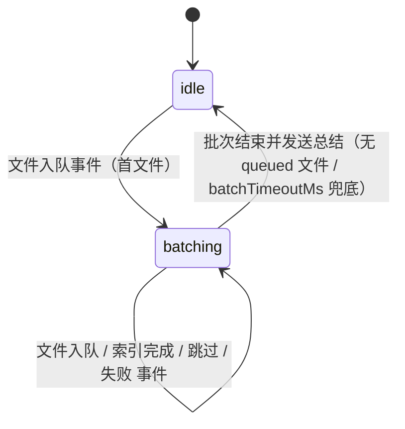
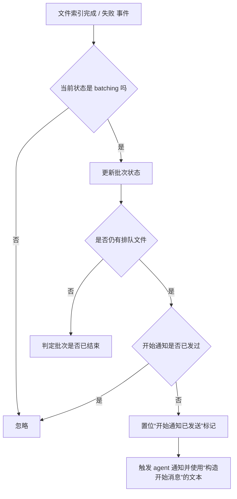
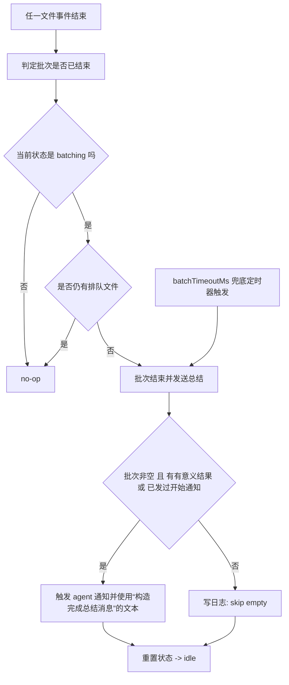
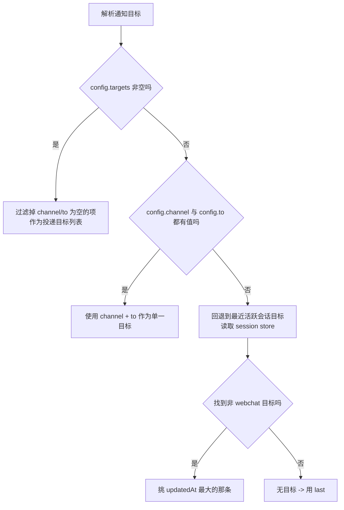
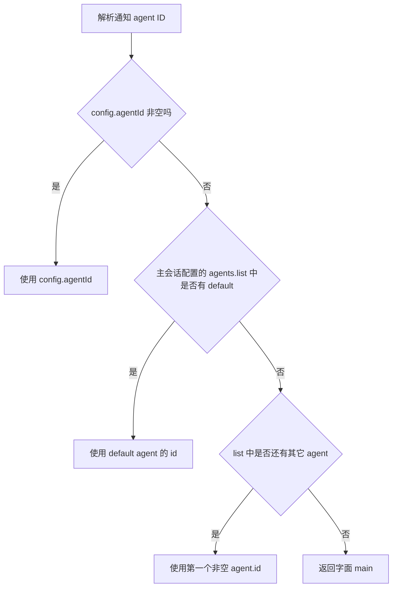

# Multimodal RAG 通知机制

本文档描述插件的通知器如何把 watcher 的索引事件聚合成“开始 / 完成”两类通知，并通过 `openclaw agent --deliver` 让 agent 用其当前人设回复用户。

> 配套文档：
> - [配置参考](./configuration.md#26-notifications)
> - [运维与故障排查](./operations.md)

---

## 1. 总体定位

通知**不是**插件直接对外发文本。通知器只做两件事：

1. 把 watcher 的“文件入队事件 / 文件索引完成事件 / 文件跳过事件 / 文件失败事件”聚合成“批次”，决定何时发出“开始索引”和“索引完成总结”两类事件。
2. 把事件文本作为 prompt 投给 `openclaw agent --deliver`，由 agent 用 IDENTITY/SOUL 人设生成最终回复，并由 OpenClaw 的 deliver 流程把消息送回到目标渠道。

这样设计的目的是：**让通知与 agent 的语气保持一致**，而不是出现一段“硬邦邦”的模板化系统消息夹在用户的对话里（实现见 `src/notifier.ts`）。

> 通知模块本身只在 `notifications.enabled = true` 时才会被构造。`enabled = false` 时 watcher 不会持有任何通知回调，所有事件都被静默丢弃。

---

## 2. 状态机

通知器内部维护一个极简两态状态机：



| 转移 | 触发条件 | 副作用 |
|---|---|---|
| `idle → batching` | 第一个“文件入队事件”进入批次 | 记录批次起始时间、安装 `setTimeout(batchTimeoutMs)` 兜底定时器 |
| `batching → batching` | 后续任何事件 | 更新批次 Map 中的文件状态 |
| `batching → idle` | 执行“批次结束并发送总结” | 清理定时器、按需触发完成通知、清空批次 |

四个事件回调都会在“`state === idle` 且文件不在当前批次内”时被忽略，避免在批次重置后被晚到的事件污染下一轮。

---

## 3. 批次内文件状态

批次以 `Map<filePath, { status, fileType?, error? }>` 形式维护。

| status | 对应事件 | 何时进入 |
|---|---|---|
| `queued` | 文件入队事件 | 文件入处理队列 |
| `indexed` | 文件索引完成事件 | 文件索引成功 |
| `skipped` | 文件跳过事件 | unchanged / metadata-updated / moved / broken / deleted |
| `failed` | 文件失败事件 | 重试耗尽或非临时错误 |

**关键不变量**：

- “是否仍有排队文件”的判断只看 `status === "queued"`
- “是否有有意义的结果”只看 `indexed | failed`
- 跳过的文件不会单独触发开始/完成通知，但会被计入完成总结的“跳过 N 个”里

---

## 4. 开始通知发送时机



- 开始通知**只在出现首个有效结果（indexed/failed）且批次内仍有排队文件时**发出。“文件跳过事件”不触发开始通知。
- 一个批次最多发一次开始通知（由“开始通知已发送”标记守卫）。
- 如果批次只有 1 个文件，第一次状态切到 `indexed/failed` 时就没有 queued 了，此时**不会**发开始通知，直接走完成通知。

完成通知的总结在出现 indexed/failed 结果（或上一轮已发过开始通知）时一定会发；只有“批次里全是 skipped 且从未发过开始通知”才会被静默丢弃（实现见 `src/notifier.ts`）。

---

## 5. 完成判定



- **首选触发条件**：“是否仍有排队文件”为 false（即批次内所有文件状态都已脱离 `queued`）。
- **兜底触发条件**：`batchTimeoutMs` 计时器到期。该计时器在批次开始时启动一次，无论批次结束是否被提前调用都会清掉。
- **静默条件**：批次大小为 0，或者“没有任何 indexed/failed 且从未发过开始通知”——只有 skipped 的批次会被记 `Skip notification: empty batch`。

> 注意：`notifications.quietWindowMs` 字段在 manifest/config 中保留，但当前“批次结束”路径不会主动等待该窗口。它代表“最后一个文件处理完后等多久再发”的设计意图，未来若引入 quiet-window 兜底将复用该字段。今天的运行行为以“是否仍有排队文件”与 `batchTimeoutMs` 为准。

---

## 6. 总结消息构建

“构造完成总结消息”输出固定前缀 `[Multimodal RAG] 索引完成通知:`，再拼接：

| 字段 | 取值 |
|---|---|
| 处理总数 `total` | `succeeded.length + failed.length`（**不含 skipped**） |
| 成功数 | `succeeded.length` |
| 类型分解 | 在成功项里数 `fileType === "image"` 与 `fileType === "audio"` |
| 失败数 | `failed.length`，仅在 >0 时追加 |
| 跳过数 | `skipped.length`，仅在 >0 时追加，写在“另跳过 N 个已存在文件” |
| 耗时 | 当前时间与批次起始时间之差，>=60s 显示“X 分 Y 秒”，否则“Y 秒” |

特殊分支：

- `total === 0 && skipped > 0`：输出“本轮没有新增文件需要索引（跳过 N 个已存在文件）。耗时 …。请通知用户。”
- `total === 0 && skipped === 0`：输出“本轮没有可汇总的处理结果。耗时 …。请通知用户。”

“构造开始消息”固定输出 `[Multimodal RAG] 新文件索引通知: 已开始处理本轮新增媒体文件，请通知用户。`。

---

## 7. 目标解析（三级回退）



### 7.1 第一优先：`notifications.targets[]`

每项形态 `{ channel, to, accountId? }`。`channel` 与 `to` 都会 `.trim()`，空字符串项被丢弃。如果数组里至少有一条合法项，就用整个数组**逐个**投递。

### 7.2 第二优先：`notifications.channel + notifications.to`

需要两者都不为空。返回单元素数组 `[{ channel, to }]`。

### 7.3 第三优先：session-store 自动回退

“回退到最近活跃会话目标”做以下事情：

1. 通过 `runtime.config.loadConfig()` 读出根配置；
2. 通过 `runtime.channel.session.resolveStorePath(cfg.session?.store)` 解析 session store 路径；
3. 直接 `readFile + JSON.parse`，遍历所有 entry；
4. 跳过 `lastChannel === "webchat"` 与缺失 `lastChannel/lastTo` 的项；
5. 在余下 entry 里挑 `updatedAt` 最大的，构造 `{ channel: lastChannel, to: lastTo, accountId?: lastAccountId }` 返回；
6. 解析失败则 warn 后返回 `null`。

所有目标都没找到时，投递目标列表退化成 `[undefined]`，命令里以 `--reply-channel last` 兜底（§8）。

> 把 webchat 显式排除是为了避免把 “Web UI 临时会话” 当作长期通知目标——webchat 通常没有持久 chat id，回投会失败。

---

## 8. agent 命令构造

“构造 agent 命令行”会拼一条 `argv` 数组传给 `runtime.system.runCommandWithTimeout`（180 秒超时）。命令优先用当前 Node 进程 + CLI 入口（`process.execPath` + `process.argv[1]`）以保证使用同一份 OpenClaw 二进制；否则回退到 `openclaw`。

模板（按字段顺序）：

```
openclaw agent --agent <agentId> --message <prompt> --thinking low --deliver --timeout 120 --reply-channel <target.channel | "last"> [--reply-to <target.to>] [--reply-account <target.accountId>]
```

| 字段 | 来源 |
|---|---|
| `--agent` | “解析通知 agent ID”（§9） |
| `--message` | “构造给 agent 的提示词”（§10） |
| `--thinking low` | 固定 |
| `--deliver` | 固定，让 agent 自己把回复送回渠道 |
| `--timeout 120` | 固定（agent turn 自身的超时；`runCommandWithTimeout` 另有 180s 包络） |
| `--reply-channel` | `target.channel`；为 undefined 时用字面 `last` |
| `--reply-to` | `target.to`，仅在存在时附带 |
| `--reply-account` | `target.accountId`，仅在存在时附带 |

每条 target 投递的成功/失败计数都会写日志。只要至少一条成功就返回 `true`，否则在“执行单次 agent 触发”顶层打 `Notification agent trigger failed for all targets: ...`（实现见 `src/notifier.ts`）。

---

## 9. agentId 解析（三级回退）



主会话配置来自 `api.config`，与 root config 是同一份数据。

> 与 `--reply-channel "last"` 同理：把 `"main"` 作为最终兜底，是为了让单 agent 用户的零配置也能跑通通知。

---

## 10. agent prompt 模板

“构造给 agent 的提示词”返回的中文 prompt 包含 8 行约束：

```
你收到一条来自 Multimodal RAG 的索引事件通知。
请严格按你当前 agent 的人格设定回复，优先遵循已注入的 IDENTITY.md / SOUL.md。
如果本轮上下文里看不到 IDENTITY.md 或 SOUL.md，请先读取工作区对应文件（存在就读），再回复。
禁止调用 message、sessions_send、sessions_spawn 等消息投递工具；系统会用 --deliver 自动投递。
除非为了读取 IDENTITY.md / SOUL.md，否则不要调用其他工具。
只输出最终发给用户的通知正文,不要输出"已发送/已通知/处理中"等过程状态。
避免模板化官腔，用该 agent 一贯口吻写一段自然中文通知。
事件内容：<text>
```

关键含义：

1. **强制让 agent 用 IDENTITY/SOUL 人设说话**，避免“系统通知”味道。
2. **禁止 agent 自己调消息工具**——所有投递走 `--deliver`，否则会出现“agent 自己 send 一遍 + deliver 再 send 一遍”的双发。
3. **只允许读 IDENTITY.md / SOUL.md**，避免 agent 顺手开 shell / 抓网页等无关动作。
4. **要求只输出最终正文**，避免“正在发送”这类元话术。

---

## 11. 顺序投递保证

“触发 agent 通知”不直接 `await` 每次执行，而是把它挂到一个顺序投递队列（`Promise<void>` 链）上：

```ts
this.deliveryChain = this.deliveryChain
  .then(() => this.triggerAgentInternal(text))
  .catch((err) => this.logger.warn?.(`Failed to enqueue notification trigger: ${String(err)}`));
```

效果：

- “开始通知” 与 “完成通知” 在同一个批次里触发时**严格保持先后顺序**。
- 投递发生异常时，`catch` 把错误降级成 warn，不让 Promise 链断裂，下一次通知仍能继续投递。
- 单条 agent turn 的投递耗时（180s 超时）不会阻塞 watcher 的事件回调——回调本身永远只是把 Promise 挂到链上立即返回。

> 之所以串行是因为：用户视角上“开始 → 完成”一旦乱序就会很怪。多 target 内部仍是串行（`for...of` 等待每个 `runCommandWithTimeout`），但不同批次之间也按链式排队，避免大批量索引压垮渠道（实现见 `src/notifier.ts`）。

---

## 12. 完整通知配置示例

```json
{
  "notifications": {
    "enabled": true,
    "agentId": "main",
    "quietWindowMs": 30000,
    "batchTimeoutMs": 600000,
    "channel": "last",
    "to": "",
    "targets": [
      { "channel": "telegram", "to": "123456789" },
      { "channel": "feishu",   "to": "oc_abc123def456",  "accountId": "ou_owner_a" }
    ]
  }
}
```

行为解释：

- `enabled: true` → 通知器被实例化，watcher 携带回调。
- `targets` 非空 → 第一优先生效；`channel`/`to` 字段被忽略。
- 每个批次完成时，会**逐个**对 `telegram:123456789`、`feishu:oc_abc123def456` 触发 agent turn；只要其中一条成功投递就视为成功。
- agent 用 `main` 人设回复；prompt 强制其按 IDENTITY/SOUL 风格写。
- `batchTimeoutMs = 600000`（10 分钟）保证即使 watcher 卡住，最迟 10 分钟后通知也会发出。

> 想关闭通知，只需把 `enabled` 改为 `false` 并重启 gateway；其它字段保留即可，不会有副作用。
