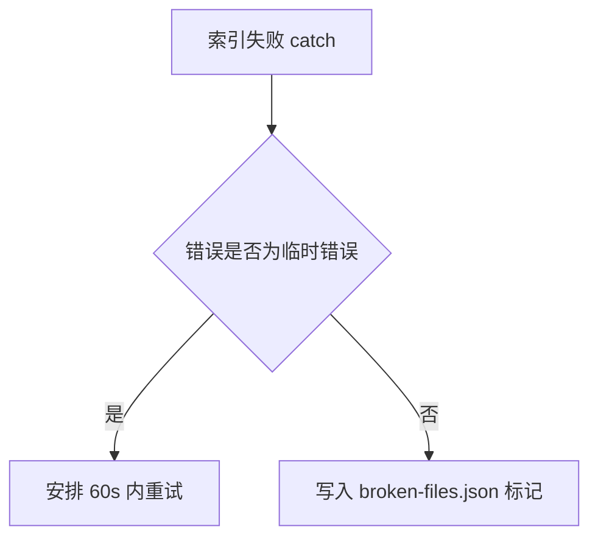
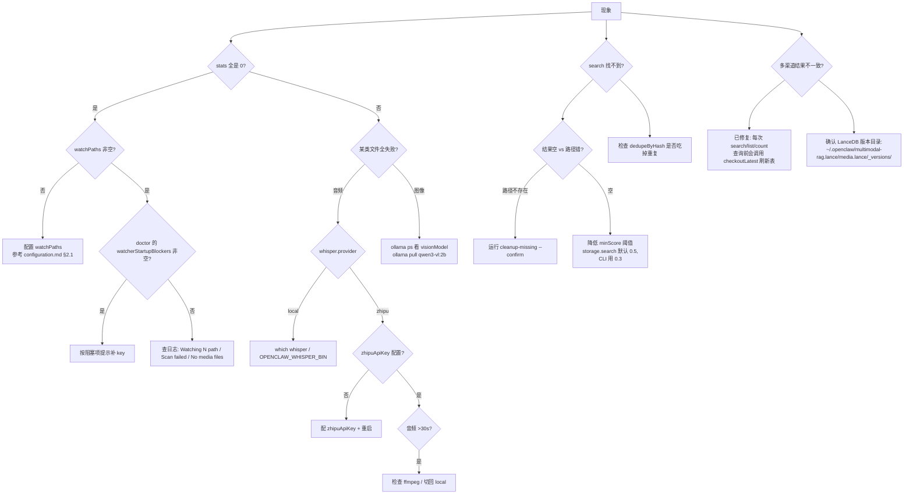

# Multimodal RAG 运维与故障排查

本文档描述插件运维相关的命令、状态文件、健康检查与故障排查路径。

> 配套文档：
> - [配置参考](./configuration.md)
> - [通知机制](./notifications.md)
> - [架构总览](./architecture.md)

---

## 1. `openclaw multimodal-rag doctor`

诊断命令，输出当前 runtime 视角下的“配置 + 警告 + 阻塞 + 依赖提示”。

```bash
openclaw multimodal-rag doctor
```

内部由“构造诊断报告”流程生成 JSON。返回的 JSON 包含 4 个顶层字段：

### 1.1 `runtimeConfig`

把当前 runtime 已生效的配置打平成调试视图：

| 字段 | 含义 | 来源 |
|---|---|---|
| `embeddingProvider` | `ollama \| openai` | `runtime.config.embedding.provider` |
| `whisperProvider` | `local \| zhipu` | `runtime.config.whisper.provider` |
| `ollamaBaseUrl` | 当前 Ollama base URL | `runtime.config.ollama.baseUrl` |
| `ollamaApiKeyConfigured` | 是否配置了 Ollama API Key（不暴露原始值） | `!!runtime.config.ollama.apiKey` |
| `visionModel` | 视觉模型 id | `runtime.config.ollama.visionModel` |
| `embedModel` | 嵌入模型 id | `runtime.config.ollama.embedModel` |
| `dbPath` | LanceDB 实际解析后的路径 | `runtime.resolvedDbPath` |

### 1.2 `deferredWarnings`

由“收集延迟失败警告”产出。当前可能出现两条：

- `embedding.provider=openai 但未配置 embedding.openaiApiKey；插件已加载，但语义搜索和索引会在执行时失败`
- `whisper.provider=zhipu 但未配置 whisper.zhipuApiKey；插件已加载，但音频转录会在执行时失败`

含义：插件已加载，CLI/工具可以调用，但相关执行路径会在运行期抛错。

### 1.3 `watcherStartupBlockers`

由“收集监听服务启动阻塞项”产出。当前唯一一条：

- `embedding.provider=openai 但未配置 embedding.openaiApiKey，后台索引已禁用`

含义：watcher 在 `start()` 阶段会直接 `return false`，文件监听不启动；已有索引仍可查询，但不会再产生新索引。

### 1.4 `dependencyHints`

“构造依赖提示”输出的结构：

| 字段 | 含义 |
|---|---|
| `whisperProvider` | 当前 Whisper 后端 |
| `whisperBin` | 本地 Whisper 二进制路径，仅 `whisper.provider=local` 时存在 |
| `zhipuApiKeyConfigured` | 仅 `whisper.provider=zhipu` 时输出 |
| `zhipuModel` | 仅 `whisper.provider=zhipu` 时输出 |
| `ffmpegRequired` | 始终 `true`（音频切片依赖 ffmpeg） |
| `ollamaRequiredForImage` | 始终 `true`（图像描述始终走 Ollama 视觉模型） |
| `ollamaRequiredForEmbedding` | `embedding.provider === "ollama"` 时为 true |
| `openaiKeyConfigured` | 当 provider=openai 时反映 key 是否配置；其他情况下默认 `true` |

> 同样的报告会在插件加载时通过“记录诊断报告到日志”写到 logger，用于运行期追溯“当时的配置是什么”（`src/doctor.ts`）。

---

## 2. broken-file 标记机制（持久化失败标记）

为了避免对“同一份坏文件”反复花时间转录/识别后再失败，watcher 会维护一个持久化的 broken-file 标记。

### 2.1 文件位置与结构

- 路径：`${dbPath}.broken-files.json`
- 与 LanceDB 数据库目录平级，便于 cleanup 时一并处理
- 内容：

```json
{
  "/abs/path/to/file.wav": {
    "size": 123456,
    "mtimeMs": 1707000000000,
    "error": "GLM-ASR 转录失败: HTTP 400 ...",
    "markedAt": 1707000050000
  }
}
```

`size` / `mtimeMs` 用来判断文件是否原地“被改动过”（定义见 `src/watcher.ts`）。

### 2.2 何时打标

仅在错误被判定为“非临时错误”时打标：



临时错误识别命中以下任一关键字时视为“临时错误，不打标”：

`internal server error`、`ollama`、`econnrefused`、`econnreset`、`etimedout`、`fetch failed`、`timeout`、`aborted`。

### 2.3 何时清除

| 触发 | 行为 |
|---|---|
| 文件 `size` + `mtimeMs` 变化 | 启动扫描时比较若不一致就自动清标 |
| 索引成功 | 成功路径主动清标 |
| 文件被删除 / 索引时遭遇 ENOENT | 同步移除索引行与 broken-file 标记 |
| `multimodal-rag cleanup-failed-media --confirm` | CLI 命令同时清失败媒体记录与 broken-file 标记 |

### 2.4 启动期的 skip 行为

启动批量扫描时也会先判断文件是否仍命中 broken-file 标记，未变更的坏文件直接计入 `skippedBrokenFiles` 而不入队。日志中会出现 `Skipped N unchanged broken file(s) during startup scan`。

---

## 3. 三种 cleanup 命令对比

| 命令 | 作用对象 | 何时使用 | 删除什么 | 副作用 |
|---|---|---|---|---|
| `cleanup-missing` | LanceDB 索引中“路径在磁盘上已不存在”的条目 | 文件被外部删除 / 移动后，索引出现孤儿 | 仅删 LanceDB 行 | 写日志 `cleanup_missing_entries_completed` |
| `cleanup-failed-media` | 历史失败写入的脏描述（`转录失败` / `Whisper 转录失败` / `GLM-ASR 转录失败` / `Qwen3-VL processing failed:` / `Empty description from Qwen3-VL`） | 早期版本会把失败信息写进 `description`；想清掉这些“本质上没成功”的索引条目 | LanceDB 行 + broken-file 标记全部清空 | 触发 auto-optimize |
| `reindex --confirm` | 整张表 + 整个工作流 | 嵌入维度变更 / 数据严重不一致 / 想强制用新模型重跑全部 | 整表清空（`id IS NOT NULL`）后重新扫描所有 watch path | 比较重，时间随媒体数线性增长 |

命令签名：

```bash
openclaw multimodal-rag cleanup-missing --dry-run            # 仅扫描
openclaw multimodal-rag cleanup-missing --confirm [--limit N] # 实际删除
openclaw multimodal-rag cleanup-failed-media --confirm        # 历史脏数据
openclaw multimodal-rag cleanup-failed-audio --confirm        # 兼容旧名，等价
openclaw multimodal-rag reindex --confirm                     # 清空 + 全量索引
```

> `cleanup-missing` 在 `search`/`list` 命令内部也会被自动触发：返回结果里若发现路径不存在，CLI 会顺手清掉那些 ID（实现见 `src/cli.ts`）。

---

## 4. Ollama 健康检查

健康检查流程：

```mermaid
flowchart TD
  A[Ollama 健康检查] --> B{距上次检查 <60s 且上次健康吗}
  B -- 是 --> H[直接返回 true]
  B -- 否 --> C[更新上次检查时间戳]
  C --> D[GET ${baseUrl}/api/tags<br/>5s timeout, 携带 Authorization]
  D --> R{response.ok?}
  R -- 是 --> Y1[标记为健康]
  R -- 否 + 404 --> P[GET ${baseUrl}/v1/models<br/>5s timeout]
  R -- 否 + 其它 --> Y2[标记为不健康, warn HTTP 状态]
  P --> P2{response.ok?}
  P2 -- 是 --> Y1
  P2 -- 否 --> Y2
```

- 缓存窗口：60 秒，但**只有上一次被标记为健康时才走缓存**；上一次失败的话会重新探测。
- 双探针：先试原生 Ollama 的 `/api/tags`，404 时回退 OpenAI 兼容代理的 `/v1/models`。
- 鉴权：若配置了 `ollama.apiKey`，同时附带 `Authorization: Bearer …` 与 `api-key: …`。
- 健康检查只在“当前文件确实需要 Ollama”时才被触发：图像必检；音频仅在 `embedding.provider === "ollama"` 时才检。

健康检查失败时索引流程会安排 60 秒后的重试，最多三次，达到上限后触发“文件失败事件”（实现见 `src/watcher.ts`）。

---

## 5. 常见故障决策树



要点：

- “索引为 0” 多半是 watcher 没起来：先 `openclaw multimodal-rag doctor` 看 `watcherStartupBlockers`，再翻日志找 `No watch paths configured` 或 `Background indexing disabled`。
- “某类文件失败”按 provider 分支查依赖（§7、§8）。
- 跨渠道一致性问题由 `src/storage.ts` 中的刷新到最新版本逻辑兜底，每次 search/list/count 之前都会 refresh。

---

## 6. LanceDB 数据库维护

存储实现：`src/storage.ts`。详细机制见 [storage.md](./storage.md)。

### 6.1 自动 optimize

| 默认参数 | 值 |
|---|---|
| `autoOptimizeThreshold` | 20 次脏写 |
| `autoOptimizeIdleMs` | 5 分钟 |

写入路径（`store / delete / clear / cleanupFailedMediaEntries`）会记录为“脏写”：

- 累积 ≥ 阈值时立即调度（`delayMs = 0`）
- 否则延后 `autoOptimizeIdleMs` 触发
- 同一批多次写只保留最后一个 `setTimeout`，并在 `optimize()` 期间挂起的写入会在结束后再排一次

自动 optimize 执行顺序：

1. 刷新到最新版本
2. `table.optimize()`
3. 再刷新一次最新版本（让本进程后续查询看到 compact 后的版本）

### 6.2 手动重建索引步骤

只有在嵌入维度变更（参考 [configuration.md §8](./configuration.md#8-配置变更指南)）或数据库出现明显损坏时才需要：

```bash
openclaw multimodal-rag stats                                # 1) 记录当前总数
openclaw multimodal-rag cleanup-missing --dry-run            # 2) 看一眼孤儿
openclaw multimodal-rag reindex --confirm                    # 3) 清表 + 全量重建
openclaw multimodal-rag stats                                # 4) 验证数量回升
```

`reindex` 内部的实际动作：`storage.clear()` 删全部行 → 重置 watcher 队列 → 重新扫描缺失文件并入队。

> 数据库目录可以直接 `rm -rf ${dbPath}` 后再重启 gateway 触发首次创建。表 schema 在初始化时通过占位行写入。

---

## 7. 环境变量参考

| 变量 | 作用 |
|---|---|
| `OPENCLAW_WHISPER_BIN` | 自定义本地 Whisper 二进制（最高优先级） |
| `WHISPER_BIN` | 通用 Whisper 二进制覆盖 |

仅 `whisper.provider=local` 路径会读取（定义见 `src/whisper-bin.ts`）。

```bash
OPENCLAW_WHISPER_BIN=/opt/whisper/bin/whisper systemctl --user restart openclaw-gateway.service
```

---

## 8. 依赖检查清单

| 依赖 | 何时必需 | 验证命令 |
|---|---|---|
| `ffmpeg` | 始终（HEIC 预处理 + GLM-ASR 切片） | `ffmpeg -version` |
| 本地 `whisper` CLI | `whisper.provider=local` | `whisper --help` 或 `${OPENCLAW_WHISPER_BIN:-whisper} --help` |
| Ollama 服务 | 图像始终 / 嵌入仅当 `embedding.provider=ollama` | `curl -fsS ${OLLAMA_BASE_URL:-http://127.0.0.1:11434}/api/tags` |
| Ollama 视觉模型 | 始终 | `ollama list \| grep qwen3-vl:2b` |
| Ollama 嵌入模型 | `embedding.provider=ollama` | `ollama list \| grep qwen3-embedding` |
| 智谱 API Key | `whisper.provider=zhipu` | `openclaw multimodal-rag doctor` 看 `dependencyHints.zhipuApiKeyConfigured` |
| OpenAI API Key | `embedding.provider=openai` | `openclaw multimodal-rag doctor` 看 `dependencyHints.openaiKeyConfigured` |

---

## 9. 日志查找

watcher 关键事件以 JSON 单行写入 logger，便于 `grep + jq`。

| event | 何时触发 | 关键字段 |
|---|---|---|
| `index_file_start` | 进入索引主流程 | `filePath, fileType, provider` |
| `index_file_success` | 入库成功 | `filePath, fileType, stage="stored", durationMs` |
| `index_file_failed` | 单次失败（任何分类） | `filePath, fileType, stage, durationMs, retryAttempt, errorClass` |
| `index_file_retry_scheduled` | 安排 60s 后重试 | `filePath, fileType, stage, retryAttempt, errorClass / reason, retryDelayMs` |
| `index_file_moved_reused` | 命中“同 hash 已被搬走” | `filePath, fileType, reusedFromPath, source, durationMs` |
| `cleanup_missing_entries_completed` | `cleanupMissingEntries` 结束 | `scanned, missing, removed, durationMs, hitRate, dryRun` |

`errorClass` 可能值：`missing_file | transient | whisper | ollama | unknown`（定义见 `src/watcher.ts`）。

常用日志查询：

```bash
# 最近的索引完成事件
grep '"event":"index_file_success"' /tmp/openclaw/openclaw-$(date +%Y-%m-%d).log

# 当前重试中的文件
grep '"event":"index_file_retry_scheduled"' /tmp/openclaw/openclaw-$(date +%Y-%m-%d).log

# cleanup 历史
grep '"event":"cleanup_missing_entries_completed"' /tmp/openclaw/openclaw-$(date +%Y-%m-%d).log
```

> 完整索引流程（事件触发顺序、重试退避、moved-reuse 等）见 [indexing-pipeline.md](./indexing-pipeline.md)。
