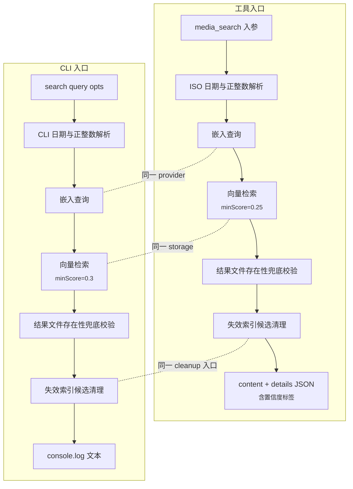
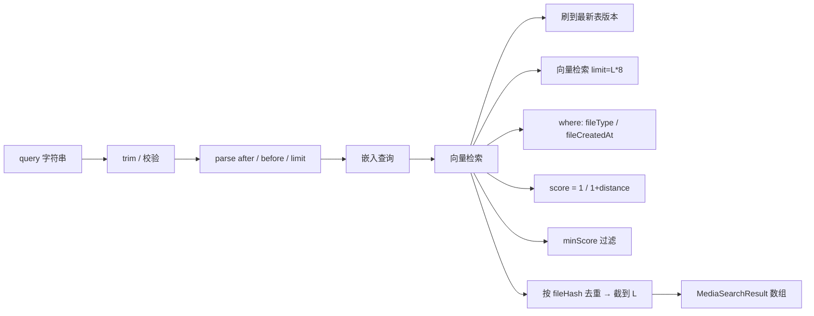
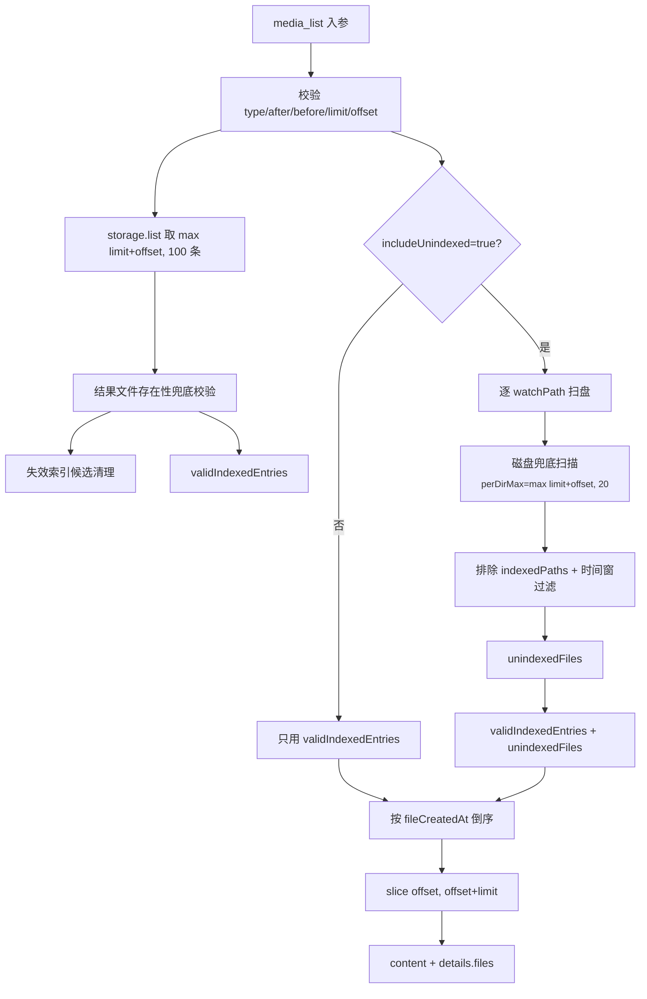

# Multimodal-RAG 检索链路（search-and-retrieval）

本文聚焦检索侧——从用户/Agent 的一句中文 query 到最终返回媒体列表的完整链路。
索引侧细节见 `indexing-pipeline.md`，向量库存储与 cleanup/dedupe 实现在
`storage.md`，工具的对外语义与渠道适配见 `agent-tools.md`。

---

## 1. 两个检索入口：完全等价

multimodal-rag 暴露的两条检索路径走的是**同一份**"嵌入查询 + 向量检索"
链路，仅渲染层不同：

| 入口                                                                                                                | 用户                       | 渲染               |
| ------------------------------------------------------------------------------------------------------------------- | -------------------------- | ------------------ |
| Agent 工具 `media_search`                                                                                           | 通过 channel 与 LLM 交互   | `content` + `details` JSON |
| CLI 命令 `openclaw multimodal-rag search <query>`                                                                   | 通过 shell 直连            | `console.log` 文本 |

工具入口提供 `media_describe / media_stats / media_list` 等姊妹工具，CLI 入口
提供 `list / stats / cleanup-missing / cleanup-failed-media / reindex / index
/ doctor` 等命令。本文只描述检索链路（`search` 与 `media_list` 兜底），其它
命令归 `operations.md` / `agent-tools.md`（参见 `src/tools.ts:194-804`、
`src/cli.ts:96-394`）。



---

## 2. 完整检索链路

工具与 CLI 的执行顺序基本一致：参数校验 → 生成查询向量 → 向量检索 → 文件
存在性兜底 → 自愈清理 → 渲染。

### 2.1 参数校验

| 校验项     | 工具行为                                                                | CLI 行为                                                |
| ---------- | ----------------------------------------------------------------------- | ------------------------------------------------------- |
| `query`    | `typeof query === "string"` + `trim()`，空字符串直接返回 `invalid_query` | 同上，空字符串抛 `query 不能为空`                        |
| `after / before` | ISO 日期解析：`new Date(...).getTime()` 非 finite 抛 `不是合法日期，示例：...` | CLI 日期解析相同语义                                    |
| `limit`    | 正整数解析，`min=1`，默认 5                                              | CLI 正整数解析，相同默认值                              |
| `range`    | `after > before` 时返回 `invalid_date_range`                            | 同样抛 `after 不能晚于 before`                          |

非法参数在工具侧返回 `{ content: makeTextContent(<msg>), details: { count: 0,
error: <code> } }`；CLI 侧 `console.error` 后 `process.exit(1)`（参见
`src/tools.ts:36-64, 248-279`、`src/cli.ts:38-68, 106-118`）。

### 2.2 生成查询向量

工具与 CLI 都走 `await embeddings.embed(normalizedQuery)`。这条调用可能命中：

- Ollama 嵌入服务：3 次重试，POST `/api/embed`，详见 `indexing-pipeline.md`
  §10.1。
- OpenAI 嵌入服务：无重试，POST `/v1/embeddings`。

embedding 抛错时：

- 工具侧 `try/catch` 包了整段 search，错误时仍调一次 `storage.count()` 拿
  总数，返回 `搜索时遇到技术问题，请稍后重试。\n\n数据库中共有 N 个已索引
  文件。` 并把错误 message 放到 `details.error`。
- CLI 侧整段 search 也包在 `try/catch` 里，失败时 `console.error("搜索失败:
  ...")` + `process.exit(1)`（参见 `src/tools.ts:299, 402-417`、`src/cli.ts:124,
  168-171`）。

### 2.3 向量检索调用

入参契约（参考 `storage.md` 的 `SearchOptions`）：

```ts
storage.search(vector, {
  type: "image" | "audio" | "all",  // 默认 "all"
  after?: number,                    // ms
  before?: number,                   // ms
  limit: number,
  minScore: number,                  // 工具 0.25 / CLI 0.3
});
```

`storage.search` 自身做的事（详见 `storage.md`）：

1. 刷到最新表版本，保证多实例一致性。
2. 用 `dedupeByHash=true`（默认）时，候选 limit 放大为 `limit * 8`，
   `vectorSearch(vector).limit(candidateLimit)`。
3. 时间 + type 过滤拼成 `WHERE` 子句，字段名一律反引号包裹避免 LanceDB
   大小写问题。
4. L2 距离转相似度：`score = 1 / (1 + distance)`。
5. `score >= minScore` 过滤。
6. 按 `fileHash` 去重（找不到 hash 退化为按 id 去重），保留每组分数最高那条，
   截到 `limit` 条返回（参见 `src/storage.ts:282-288`）。

返回 `MediaSearchResult[]`，每条形如 `{ entry: MediaEntry, score: number }`。



### 2.4 文件存在性兜底校验

不论是工具还是 CLI，拿到 `results` 后都不直接展示，而是先做一轮路径存在性
校验。工具侧与 CLI 侧各有一份对称实现：

1. `Promise.all` 并行 `stat(filePath)` 每个候选。
2. 成功 → 视为 `existing`，把 `id` 推到 `existingIds: Set<string>`。
3. 失败且 errno 是 `ENOENT/ENOTDIR` → 视为 `missing`，推到 `missingCandidates`。
4. 其它 IO 错误 → 既不是 existing 也不是 missing（避免误删）（参见
   `src/tools.ts:84-113`、`src/cli.ts:11-36`）。

为什么需要这步：索引落库时间和文件被外部移动/删除是异步的——LanceDB 里仍能
搜出来一条命中度 80% 的图，但磁盘上文件已经不在了。直接把 `filePath` 透传
给 Agent，Agent 拿去发文件就会失败。

### 2.5 自愈清理

`missingCandidates.length > 0` 时立即调用：

```ts
storage.cleanupMissingEntries({ candidates: missingCandidates, dryRun: false });
```

候选模式（带 `candidates` 入参）下 `cleanupMissingEntries` 不会全表扫描，
只对传入的几条做 `stat` 校验后删除。返回 `{ scanned, missing, removed,
missingIds }`，本链路只取 `removed` 累加到 `cleanedMissing`：

- 工具侧把 `cleanedMissing` 放进 `details`，并在结果末尾或"未找到"提示里
  追加 `已自动清理 N 条"源文件已删除"的失效索引`。
- CLI 侧在结果末尾打印 `已自动清理 N 条失效索引。`（参见
  `src/storage.ts:664-712`、`src/tools.ts:338-339, 398-400`、
  `src/cli.ts:165-167`）。

注意：这是**轻量自愈**，只清当次搜索碰到的命中候选。重型全表清理走 ready
事件的"清理失效索引"或 CLI 的 `multimodal-rag cleanup-missing`（详见
`indexing-pipeline.md` §7.1 与 `operations.md`）。

### 2.6 渲染

`visibleResults = results.filter(r => existingIds.has(r.entry.id))`。

**0 命中**：

- 工具：先 `storage.count()` 拿总数，返回提示 `未找到与「<query>」相关的媒体
  文件。\n\n数据库中共有 N 个已索引文件。建议：1. 尝试使用更通用的关键词\n
  2. 使用 media_list 工具浏览所有文件\n3. 调整时间范围（如果设置了 after /
  before）`，并附 `cleanupHint`。
- CLI：`未找到相关媒体文件` 或 `未找到相关媒体文件（已自动清理 N 条失效
  索引）`（参见 `src/tools.ts:335-352`、`src/cli.ts:147-153`）。

**有命中**：

- 工具：拼出每条多行块 `序号. [type] fileName (匹配度: P%)\n   📁 路径:
  ...\n   📅 时间: ...\n   📝 描述: ...`，最后追加一句强制指令 `⚠️ 立即使用
  当前聊天渠道对应的方式将上述文件发送给用户！`。
- CLI：每条 `[type] fileName (P%)\n  路径: ...\n  时间: ...\n  描述: <前 100
  字>...`（参见 `src/tools.ts:355-401`、`src/cli.ts:156-167`）。

工具侧另把数据格式化成 `details.results: SanitizedResult[]`，剥掉了 vector
等不可序列化字段：

```ts
{
  filePath, fileName, type, description,
  matchScore: 百分比 (1 位小数),
  fileCreatedAt: ISO 字符串,
  fileModifiedAt: ISO 字符串,
}
```

`details` 还会附带 `count / query / maxMatchScore / confidence /
cleanedMissing`，方便 Agent 拿到机器可读形态。

---

## 3. minScore 阈值差异：工具偏召回、CLI 偏精度

| 入口   | 实参             | 语义                                                  |
| ------ | ---------------- | ----------------------------------------------------- |
| 工具   | `minScore: 0.25` | 25% 以上即返回，**召回优先**——给 Agent 更多决策空间   |
| CLI    | `minScore: 0.3`  | 30% 以上才显示，**精度优先**——少噪声便于人工读        |

注意：这两个阈值都是 `score = 1 / (1 + L2_distance)` 经过映射后的相似度，
不是余弦。`storage.search` 默认 `minScore = 0.5`，所以工具/CLI 都是显式下调
（参见 `src/tools.ts:315`、`src/cli.ts:131`、`src/storage.ts:282`）。

`storage.search` 的内部 `candidateLimit = limit * 8`（`dedupeByHash=true` 时
默认放大）保证就算 minScore 过滤掉一半、hash 去重再去掉一半，最终也能凑到
`limit` 条；这就是**为什么工具调小 minScore 不会反过来逼出 candidateLimit
不足**——候选池本来就是 limit 的 8 倍。

---

## 4. 搜索去重：fileHash 优先

`storage.search` 默认 `dedupeByHash = true`。语义见 `storage.md`，这里只
回顾对检索结果的影响：

- 同一张图被复制到 `~/usb_data/photo.jpg` 和 `~/mic-recordings/dump/photo.jpg`：
  两条记录有相同 `fileHash`，搜索结果只返回 score 最高的那条。
- 没有 `fileHash` 的旧条目（极少见的历史脏数据）会退化按 `id` 去重，不会被
  合并误删。
- `candidateLimit = limit * 8` 是给去重损耗预留的余量；`limit=5` 时实际从
  LanceDB 拉 40 条做后处理（参见 `src/storage.ts:283-287`）。

工具与 CLI 都不传 `dedupeByHash`，始终用默认 `true`。当前 multimodal-rag
没有任何对外开关能关掉这个去重。

---

## 5. 置信度标签

工具侧根据**首条**结果的 `score * 100` 给一个三档中文标签：

| `maxScore` 范围 | 置信度 |
| --------------- | ------ |
| `> 60`          | 高     |
| `> 40`          | 中     |
| 其它（含 ≤ 40） | 低     |

这个标签出现在 `content` 文本头（`✅ 找到 N 个相关媒体文件（置信度: 高）：`）
和 `details.confidence` 里。CLI 侧不渲染置信度，只展示百分比（参见
`src/tools.ts:385-387`）。

---

## 6. media_list 的"未索引兜底"

`media_list` 是检索的姊妹工具：用户问"最近的录音"时，纯按时间倒序列。
它有一个独有的**未索引兜底**模式（`includeUnindexed=true`，默认开启）。

### 6.1 决策图



### 6.2 关键实现细节

"磁盘兜底扫描"做的事：

1. 按 `type` 选支持的扩展名集合：`image / audio / all`。
2. 递归 `walk` 目录：跳隐藏文件、跳非文件、按扩展名过滤。
3. 每个文件 `stat` 一次，写 `{ filePath, fileName, fileType, fileCreatedAt:
   mtimeMs, fileModifiedAt: mtimeMs }`——**未索引兜底统一用 mtime 当时间基准**，
   不读 EXIF/ffprobe（避免拖慢列举）。
4. 走到 `results.length >= maxFiles * 20` 就强制中断，避免巨型目录炸内存。
5. 最后按 `fileModifiedAt` 倒序，截到 `maxFiles`（参见 `src/tools.ts:117-191`）。

`media_list` 主流程：

1. 校验通过后，先 `storage.list({ ... limit: max(parsedLimit + offset, 100),
   offset: 0 })`——多取一些便于后续合并分页。
2. 走"结果文件存在性兜底校验"+"失效索引候选清理"，与 `media_search` 完全
   一样的清理流程。
3. `includeUnindexed=true` 时，对每个 watchPath 跑"磁盘兜底扫描" `perDirMax
   = max(limit + offset, 20)` 条；用 `indexedPaths` Set 去重防止一条文件出现
   两次；按 `after / before` 时间窗手动过滤。
4. 把 indexed（带 description）与 unindexed（description 空）合并、统一按
   `fileCreatedAt` 倒序、再 `slice(offset, offset + limit)` 分页。
5. 渲染：indexed 的展示完整 description；unindexed 在文件名后追加
   `⏳(未索引)` 标记，description 位置写 `（未索引，description 为空，可用
   media_describe 触发分析）`。
6. `details.files` 每条带 `indexed: boolean`，Agent 据此决定要不要二次调
   `media_describe`（参见 `src/tools.ts:607-803`）。

### 6.3 用户感知到的差异

- 文件刚拍出来 / 录完，indexer 队列还没轮到处理 → `media_search` 暂时搜不到
  （没 description 没 vector），但 `media_list` 能列出来并标 `indexed=false`。
- Agent 拿到未索引文件后可以：
  - 直接发原文件给用户（filePath 真实存在）；
  - 或调 `media_describe(filePath)` 触发同步索引并返回详细描述（内部走
    `watcher.indexPath`，等同于 `multimodal-rag index <path>` 走的链路，
    参见 `src/tools.ts:425-501`）。

---

## 7. 失效索引自愈：search / list / CLI 三处协同

整套插件里"轻量按需自愈"出现在 4 个地方，全部走同一个
`storage.cleanupMissingEntries({ candidates, dryRun: false })` 入口：

| 触发点                              | 作用域           |
| ----------------------------------- | ---------------- |
| `media_search` 的命中候选           | 仅当次结果       |
| `media_list` 的命中候选             | 仅当次结果       |
| CLI `search` 的命中候选             | 仅当次结果       |
| CLI `list` 的命中候选               | 仅当次结果       |

每次清理后都会在结果末尾或"未找到"提示里加一行 `已自动清理 N 条失效索引`，
让用户感知到底删了什么。这种设计的意图是：

- 用户"搜东西时"才付清理代价，不用专门跑后台扫描就能让搜索结果保持干净。
- 全表 cleanup 仍走 ready 事件 + CLI `cleanup-missing`，两条路径互不冲突。

注意 `cleanupMissingEntries` 在候选模式下不会读全表，是 `Promise.all` 并发
`stat`，`stat` 用的是异步 fs，对 N 条候选最多多一次磁盘往返（参见
`src/tools.ts:319-332, 670-680`、`src/cli.ts:134-144, 248-258`）。

---

## 8. 交叉引用

- LanceDB schema、`SearchOptions` 全字段、`refreshToLatest`、`getAllRows`、
  全表 `cleanupMissingEntries`、auto-optimize：`storage.md`
- 索引主链路（embedding 调用、broken-file、move-reuse、启动自愈）：
  `indexing-pipeline.md`
- 工具语义、强制行为约束、未索引兜底的 Agent 使用模式：`agent-tools.md`
- CLI 的非检索命令（`reindex / cleanup-failed-media / doctor / index`）：
  `operations.md`
