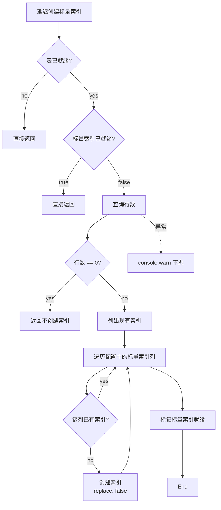
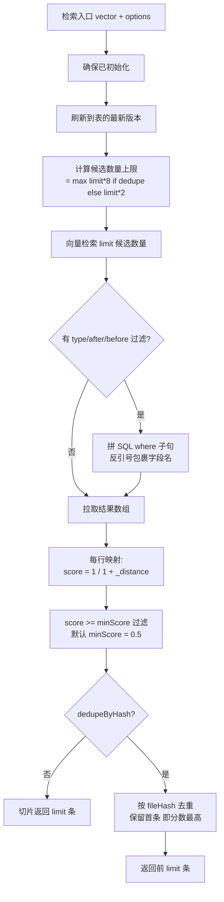
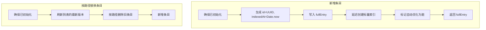
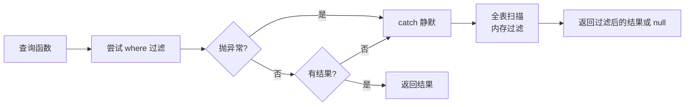
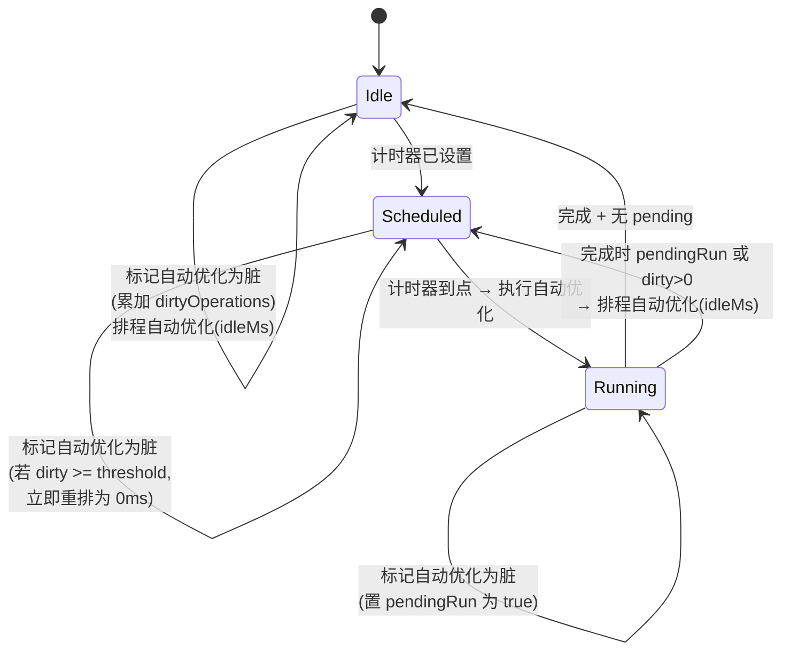
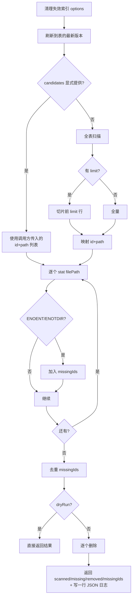

# LanceDB 存储层

> 本文档描述 multimodal-rag 插件存储层的全部细节：表结构、索引策略、检索/写入流程、跨实例一致性、查询回退、自动优化调度、清理能力。
> 所有事实都标注了源代码位置。
>
> 关联阅读：
> - [系统架构](./architecture.md)
> - [索引主链路（写入侧调用方）](./indexing-pipeline.md)
> - [检索链路（读取侧调用方）](./search-and-retrieval.md)
> - [运维与故障排查](./operations.md)
> - [插件总览（README）](../README.md)

---

## 1. 表结构

LanceDB 的表名硬编码为 `media`，存储的每一行对应一个 `MediaEntry`（表名定义见 `src/storage.ts:10`，行结构见 `src/types.ts:10-23`）。字段如下：

| 字段 | 类型 | 含义 |
|---|---|---|
| `id` | string | UUID，写入时通过 `randomUUID()` 生成 |
| `filePath` | string | 原始文件绝对路径（被监听到的真实位置）|
| `fileName` | string | 文件名（去掉目录）|
| `fileType` | `"image" \| "audio"` | 媒体类型（也是过滤维度）|
| `description` | string | 图像描述或音频转录（也是嵌入向量的输入）|
| `vector` | number[] | 嵌入向量；维度由运行时推断决定（参见 [architecture.md §5.3](./architecture.md#53-向量维度推断)）|
| `fileHash` | string | 文件 SHA-256，用于内容级去重 |
| `fileSize` | number | 文件字节数 |
| `fileCreatedAt` | number | Unix ms，文件创建时间（**时间过滤的字段**）|
| `fileModifiedAt` | number | Unix ms，文件修改时间 |
| `indexedAt` | number | Unix ms，索引时间，写入时通过 `Date.now()` 取值 |

字段的来源行号参见 `src/types.ts:10-23` 与 `src/storage.ts:246-247`。

### 1.1 Schema 占位行

LanceDB 在创建表时需要一行真实数据来推导 Arrow schema。存储层用 `id = "__schema__"` 的占位行，写入后立即删除（实现见 `src/storage.ts:108-128`）：

- `vector` 用维度长度的全零数组确定向量列宽
- `fileType: "image"` 让 Arrow 把这一列识别为字符串
- 删除条件 `id = "__schema__"` 用双引号包裹字面量是合法的 LanceDB SQL 语法

> 这种"先种再拔"模式的代价是：第一次创建表时会有一次写入加删除，但代码中只在表不存在的分支进入，二次启动直接打开已有表不会重做。

### 1.2 内部状态

存储层持有一组私有运行时状态（定义见 `src/storage.ts:59-66`）：

| 字段 | 用途 |
|---|---|
| `db` | LanceDB 顶层连接 |
| `table` | 当前表的 handle |
| `initPromise` | 防止初始化逻辑并发重入 |
| `scalarIndicesReady` | 标量索引是否已经检查过（**只检查一次**）|
| `autoOptimizeTimer` | 计划中的自动优化计时器 |
| `autoOptimizeRunning` | 是否正在执行优化 |
| `autoOptimizeDirtyOperations` | 自上次优化以来的写入次数 |
| `autoOptimizePendingRun` | 优化期间又来了写入，需要重排 |

---

## 2. 标量索引

向量检索之外，`fileType` 和 `fileCreatedAt` 是热过滤字段。存储层给它们各自建一个 LanceDB 标量索引（配置见 `src/storage.ts:11-14`）：

| 列 | 索引类型 | 选用理由（隐含） |
|---|---|---|
| `fileType` | bitmap | 只有两个枚举值（`image`/`audio`），bitmap 是该基数的最优结构 |
| `fileCreatedAt` | btree | 时间区间查询（`>=`/`<=`），btree 支持范围扫描 |

### 2.1 延迟创建逻辑

延迟创建标量索引的逻辑在每次写入后被调用（参见 `storage.ts:251`），但有四道短路：

完整流程见 `src/storage.ts:134-165`。

**关键点**：

- **空表不建索引**：避免对零行表执行索引创建浪费 IO（`storage.ts:140-143`）
- **只在第一次有数据时建一次**：标量索引就绪标记一旦为 true，后续所有写入都跳过索引检查，不会反复列出现有索引（`storage.ts:161`）
- **不重建已有索引**：遇到已建索引的列直接跳过（`storage.ts:157`）
- **失败不致命**：捕获后只 console.warn，不抛出，避免索引问题阻塞写入主路径（`storage.ts:162-164`）

---

## 3. 检索流程

向量检索是面向 Agent 工具 `media_search` 的入口（参见 [architecture.md §4](./architecture.md#4-三个执行入口)）。流程如下：

完整流程实现见 `src/storage.ts:269-358`。

### 3.1 关键参数

| 参数 | 默认 | 含义 |
|---|---|---|
| `type` | `"all"` | `"image"` / `"audio"` / `"all"` |
| `after` | — | Unix ms，闭区间下界 |
| `before` | — | Unix ms，闭区间上界 |
| `limit` | `5` | 最终返回条数 |
| `minScore` | `0.5` | 过滤阈值 |
| `dedupeByHash` | `true` | 是否按 `fileHash` 去重 |

### 3.2 候选数量放大

向量检索本身只能控制 top-K 数量，**过滤和去重发生在客户端**。如果只取 `limit` 条，过滤掉一些低分或重复 hash 后剩下的可能不够。所以候选数量按经验值放大：

- `dedupeByHash=true` 时取 8 倍 limit
- 不去重时取 2 倍 limit

8 倍系数是经验值（同一张照片可能有多份副本），保证去重后仍能凑齐 `limit` 条。具体放大规则见 `storage.ts:287`。

### 3.3 SQL where 子句构造

LanceDB 的字段名**大小写敏感**且驼峰命名需要反引号包裹。条件构造逻辑会把过滤参数拼成形如 `` `fileType` = 'image' ``、`` `fileCreatedAt` >= <ms> ``、`` `fileCreatedAt` <= <ms> `` 的子句（实现见 `storage.ts:290-309`）。

> 这里直接做字符串拼接没有用参数化，因为 `type` 是闭枚举（`"image"` / `"audio"` / `"all"`），`after`/`before` 是 number。如果未来扩展过滤维度到字符串字段，需要按按路径查找条目的方式做单引号转义（参见 `storage.ts:382`）。

### 3.4 Score 公式

LanceDB 的 `_distance` 默认是 **L2 距离**（欧氏距离）。结果映射时用 `score = 1 / (1 + distance)` 把它单调映射到 `(0, 1]`（实现见 `storage.ts:315-317`）：

- 完全匹配 → distance=0 → score=1
- 距离越大 → score 越小但永远 > 0

这是一个常用的"距离 → 相似度"转换。`minScore = 0.5` 对应 distance ≤ 1，是相对宽松的阈值。

### 3.5 fileHash 去重

去重逻辑按已经按 score 降序的结果遍历，用 Set 记录已见 `fileHash`：先到的就是分数最高的拷贝；缺 hash 时用 `id` 兜底，不会因为脏数据导致全表只剩一条；一旦凑够 `limit` 立即停（实现见 `src/storage.ts:343-356`）。

---

## 4. 写入流程

写入主入口负责"新增"；按路径替换条目则负责"更新或重建"。

完整实现见 `src/storage.ts:241-264`。

**关键决策点**

- 标量索引检查紧跟在写入之后：保证表从空变非空时立刻建索引（`storage.ts:251`）
- 自动优化的脏标记是写入侧唯一的脏标记调用点；删除、清空、清理脏描述索引也都会触发它（参见 §7）
- 按路径替换条目先刷新到最新版本再按路径删除再新增：保证读到最新版本，避免漏删旧条目（参见 §5）

---

## 5. 跨实例一致性

LanceDB 的表 handle 在打开那一刻**锁定到当时的版本**——后续其他进程/实例的写入不会自动反映在这个 handle 上。

刷新到表的最新版本通过调用 LanceDB 的 `checkoutLatest()` 把 handle 推进到最新版本；如果该方法不可用（例如表从未进入 time-travel 模式），静默忽略即可（实现见 `src/storage.ts:86-102`）。

**所有读路径都会先调它**，覆盖以下方法（行号见 `src/storage.ts`）：

| 调用方 | 行号 |
|---|---|
| 检索 | `storage.ts:275` |
| 按路径替换条目 | `storage.ts:261` |
| 按路径查找条目 | `storage.ts:376` |
| 按 hash 查找条目 | `storage.ts:413` |
| 按路径删除条目 | `storage.ts:468` |
| 全表扫描 | `storage.ts:497` |
| 清理脏描述索引 | `storage.ts:628` |
| 清理失效索引 | `storage.ts:669` |
| 执行自动优化 | `storage.ts:221, 223`（前后各一次）|

**为什么重要**：插件可能在多个 OpenClaw 渠道实例中被加载（不同消息渠道），它们写入到同一个 LanceDB 路径。如果不刷新最新版本，A 渠道写入的索引在 B 渠道的检索看不到。这是一个常见的多实例一致性陷阱。

> 静默忽略错误是因为 LanceDB 0.11+ 在某些情况下不允许显式 checkout（表从未进入 time-travel 模式），此时无害忽略即可。

---

## 6. where → 全量扫描回退

按路径查找条目、按 hash 查找条目这一类方法都使用相同的两段式策略：

完整两段式实现见 `src/storage.ts:374-443, 513-531`。

**为什么需要回退**：

- LanceDB 的 fragment 在某些状态下（特别是新写入还未压实、或多实例并发）where 查询可能返回不完整结果
- 全量扫描虽然慢，但保证一致性。在数据量小到中等（数千~数万行）时延迟可接受

### 6.1 SQL 注入防护

按路径查找条目和按 hash 查找条目都做了单引号转义（即把 `'` 替换为 `''`，见 `storage.ts:382, 415, 425`）。

按 id 删除则走另一条防护路径——UUID 正则白名单。如果传入的字符串不匹配标准 UUID 形态会立即抛错（实现见 `storage.ts:452-456`）。

### 6.2 全表扫描与隐含 limit

全表扫描的实现非常关键：必须用 `countRows()` 取实际行数，再传给 `limit()`，否则结果会被 LanceDB 沉默截断（实现见 `src/storage.ts:495-511`）。

**关键决策点**（注释在 `storage.ts:489-494`）：

> 重要：LanceDB `query().toArray()` 有一个隐含的默认 limit（约 10 行），必须显式调用 `.limit()` 才能获取全部数据。这里使用 `countRows()` 获取准确行数，然后传给 `limit()` 确保一次性取回所有行。

如果只调 `query().toArray()`，会沉默地返回大约 10 行，让按路径查找条目的全量扫描漏掉绝大多数数据。这是 LanceDB 的"行为契约陷阱"，必须显式传入实际行数才能取到全部。

---

## 7. 自动优化调度

LanceDB 是一个 append-only 的 columnar 存储，每次写入或删除都会创建新的 fragment。fragment 越多，扫描越慢。`optimize()` 把它们压实成更少更大的 fragment。

存储层实现了一个轻量的"脏块计数 + 空闲窗口"调度器。

### 7.1 阈值与窗口

默认阈值为 20 次操作，默认空闲窗口为 5 分钟（常量定义见 `src/storage.ts:15-16`）。构造时可通过 `MediaStorageOptions` 上的 `autoOptimizeThreshold` / `autoOptimizeIdleMs` 覆盖（`storage.ts:25-28, 167-181`）。

### 7.2 状态机

完整状态机覆盖在 `src/storage.ts:183-236`。

### 7.3 标记自动优化为脏的决策

每次写入路径会走以下决策（实现见 `src/storage.ts:183-196`）：

- **正在优化时**：只设 pendingRun 标记，等当前完成后由执行自动优化的 finally 块负责重排（`storage.ts:232-234`）
- **达到阈值（默认 20 操作）**：立即跑（delayMs = 0），避免大批量索引时 fragment 膨胀
- **未达阈值**：等空闲窗口（默认 5min），让陆续来的写入合并到一次优化里

### 7.4 排程自动优化的重排逻辑

每次排程都先 `clearTimeout` 旧计时器再 `setTimeout` 新的。这意味着：**只要一直有写入，优化就一直被推迟**——直到 5min 没有新写入，或累计 ≥20 操作触发立即跑。

计时器还会调用 `unref?.()`，让计时器**不阻塞 Node 进程退出**。这对短命的 CLI 调用至关重要（实现见 `storage.ts:198-208`，`unref` 调用在 `storage.ts:207`）。

### 7.5 执行自动优化的步骤

执行流程（实现见 `src/storage.ts:210-236`）：

1. 把 dirtyOperations 抢到本地变量并清零
2. 把 pendingRun 清零
3. 置 autoOptimizeRunning 为 true
4. **前后各一次刷新到表的最新版本**：优化前确保读到最新数据，优化后让其他读路径立即看到压实后的结果（`storage.ts:221, 223`）
5. 调用 `table.optimize()` 执行真正的压实，返回统计信息
6. finally：清 autoOptimizeRunning，如果期间又来了脏操作（pendingRun 或 dirtyOperations > 0），重排一次

这个设计避免了优化期间被新写入"卡住"——既不会跳过待处理写入，也不会无限递归。

---

## 8. 三种清理能力

存储层暴露三种清理路径，对应三种不同的"脏数据"。

### 8.1 清理脏描述索引

清理**历史版本写入的失败媒体条目**——那些 `description` 字段保留了"转录失败"或"VL 处理失败"占位文本的行。匹配规则用一组正则枚举各类来源（常量定义见 `src/storage.ts:17-23`）。

**流程**：

完整实现见 `src/storage.ts:619-659`。返回 `{ removed, candidates }`——`candidates` 是匹配的总数，`removed` 是实际删除数。

> 旧的 `cleanupFailedAudioEntries` 是清理脏描述索引的别名（`storage.ts:657-659`），为兼容旧 CLI 命令保留。

### 8.2 清理失效索引

清理**索引存在但原文件已丢失**的条目（用户在文件系统层面删除了原始媒体）。这是 plugin manifest 描述里"源文件删除时自动移除索引"的实现。

**接口**（定义见 `src/storage.ts:42-53`）：

- 入参：`dryRun`、`limit`、`candidates`（可选预先列出的目标）
- 出参：`scanned`、`missing`、`removed`、`missingIds`

**流程**：

完整实现见 `src/storage.ts:664-734`。

**关键设计**

- **dryRun 模式**：只扫描并报告，不真正删除。用于 doctor 报告或 UI 预览
- **limit 模式**：只扫描前 N 行。用于大库的渐进式清理
- **candidates 模式**：调用方提供精确目标列表，避免重新扫描全表。监听服务可以在文件系统事件中累积候选，然后批量调用清理
- **路径存在性判定只把 `ENOENT` 和 `ENOTDIR` 视为缺失**（实现见 `storage.ts:736-744`）。其他错误（权限、IO）不会误删
- **JSON 结构化日志**：包含 `event`、`scanned`、`missing`、`removed`、`durationMs`、`hitRate`、`dryRun`，便于聚合分析（实现见 `storage.ts:722-732`）

### 8.3 清空表

清空把表中所有行删除，但**不删除表本身**：用 `id IS NOT NULL` 匹配所有行（`id` 永远非空，即使是 schema 占位也不会真正存在了），删完之后通过自动优化的脏标记触发后续压实把空 fragment 收掉（实现见 `src/storage.ts:749-753`）。

> 用途：`openclaw multimodal-rag reindex --confirm` 类命令的底层实现。

---

## 9. 失败描述识别正则

失败描述识别正则（定义见 `src/storage.ts:17-23`）枚举了已知的"失败描述前缀"，覆盖三类来源：

| 正则 | 来源 |
|---|---|
| `/^[（(]\s*转录失败[:：]/` | 早期版本写入的中文括号包裹的转录失败描述（半角与全角括号都匹配，半角与全角冒号都匹配）|
| `/^Whisper 转录失败[:：]/` | 本地 Whisper CLI 失败时回填的占位描述 |
| `/^GLM-ASR 转录失败[:：]/` | 智谱 GLM-ASR 失败时回填的占位描述 |
| `/^Qwen3-VL processing failed:/` | Qwen3-VL 视觉处理失败 |
| `/^Empty description from Qwen3-VL$/` | Qwen3-VL 返回空字符串 |

判定逻辑逐个匹配，命中任一就视为失败条目（参见 `storage.ts:619-621`）。

> 这些正则是**幂等清理**的契约：处理器在写入时如果失败，会用以上前缀写一行占位条目；下一次调用清理脏描述索引就能把它们重新清理出来等待重试。

---

## 10. 文件索引

| 路径 | 角色 |
|---|---|
| `src/storage.ts` | 本文档全部内容的实现 |
| `src/types.ts` | `MediaEntry` / `DocChunkEntry` / `MediaSearchResult` / `DocChunkSearchResult` / `UnifiedSearchResult` / `MediaType` schema |
| `src/runtime.ts` | 在运行时初始化中实例化存储层（参见 [architecture.md §5.3](./architecture.md#53-向量维度推断) 关于向量维度）|
| `package.json` | `@lancedb/lancedb` 与 `apache-arrow` 依赖 |

---

## 11. 文档（document）子表：`doc_chunks`

与 `media` 表并行存在的第二张 LanceDB 表，专用于文档（PDF/docx/xlsx/pptx/txt/md/html）。一个文件 → N 条 chunk。

### 11.1 表结构

| 字段 | 类型 | 说明 |
|---|---|---|
| `id` | `string` | UUID，单行主键 |
| `docId` | `string` | 同一文档的 chunks 共享（当前等于文件 `sha256`） |
| `filePath` | `string` | 源文件路径（每行冗余，便于路径过滤） |
| `fileName` | `string` | `basename(filePath)` |
| `fileExt` | `string` | 小写扩展名带点（例如 `.pdf`） |
| `chunkIndex` | `number` | 0-based |
| `totalChunks` | `number` | 该文档总段数（冗余，便于展示） |
| `pageNumber` | `number` | PDF 页码（1-based），非 PDF 为 `0` |
| `heading` | `string` | 所属标题链（一期恒为 `""`，docx heading 切分预留） |
| `chunkText` | `string` | 切分后的原文段落 |
| `vector` | `number[]` | 嵌入向量，维度与 `media` 表一致（同一 embedding provider） |
| `fileHash` | `string` | 文件 sha256（hash 级一致性检查） |
| `fileSize` / `fileCreatedAt` / `fileModifiedAt` / `indexedAt` | `number` | 元数据（与 media 表语义一致） |

标量索引：`fileExt`（bitmap）与 `fileCreatedAt`（btree），见 `src/storage.ts:DOC_CHUNKS_SCALAR_INDICES`。

### 11.2 主要 API

| 方法 | 用途 |
|---|---|
| `storeDocChunks(chunks)` | 批量插入 |
| `replaceDocChunksByPath(path, chunks)` | 先按路径删光旧 chunks 再插新的 |
| `findDocChunksByPath(path)` | 按路径查，返回含 vector 的 `DocChunkEntry[]`（用于 metadata-only 复用） |
| `findDocChunksByHash(hash, limit?)` | 按 hash 查（move-reuse 基础设施，一期未启用） |
| `deleteDocChunksByPath(path)` | 按路径删除所有 chunks |
| `searchDocChunks(vector, options)` | chunk 粒度向量搜索，返回 `DocChunkSearchResult[]` |
| `searchDocsAggregated(vector, options)` | 按 `docId` 聚合 → 每文件最高分 chunk + snippet（供 `media_search`） |
| `listDocSummaries(options)` | 按路径分组列出文档（供 `media_list type='document'`） |
| `countDocs()` / `countDocChunks()` / `listIndexedDocPaths()` | 统计与启动自愈 |
| `cleanupMissingDocChunks({ dryRun, candidates })` | 清理"索引存在但源文件丢失"的文档 chunks |
| `unifiedSearch(vector, options)` | 并发查 media + doc_chunks，返回按分数合并的 `UnifiedSearchResult[]`（供 `media_search` / `/search_file`） |

### 11.3 与 media 表的差异

- **文件粒度 vs chunk 粒度**：media 表一文件一行；`doc_chunks` 一文件 N 行，通过 `docId`/`filePath` 聚合。
- **move-reuse**：仅 media 表启用；document 搬迁一期直接重解析重索引（`findMovedSourceByHash` 只接 `"image"|"audio"`）。
- **fileType 字段**：media 表使用 `fileType`；`doc_chunks` 无该字段，类型由 `fileExt` 表达。
- **失败脏数据清理**：`cleanupFailedMediaEntries` 只扫 media 表；document 的失败由 watcher 的 broken-file marker 独立管理。

> 回到 [系统架构](./architecture.md) 或 [README](../README.md)。
